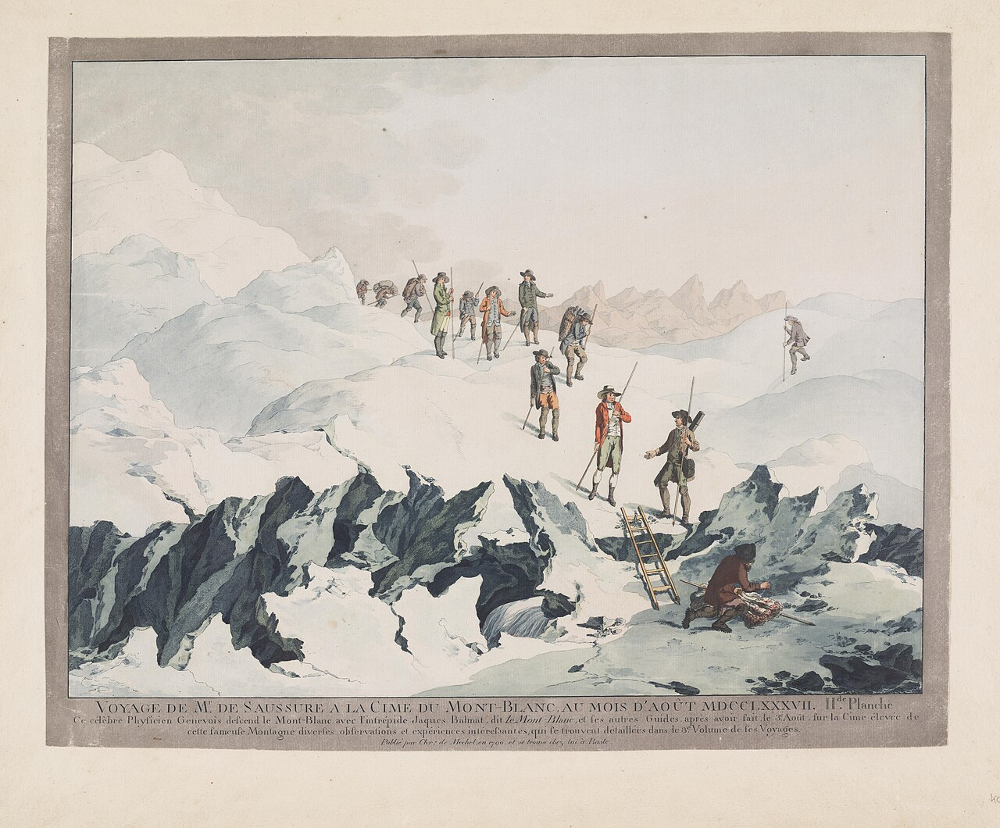
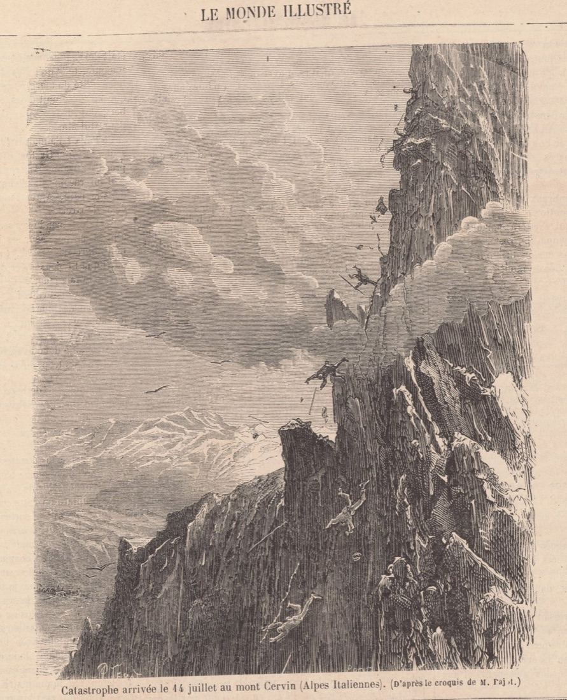
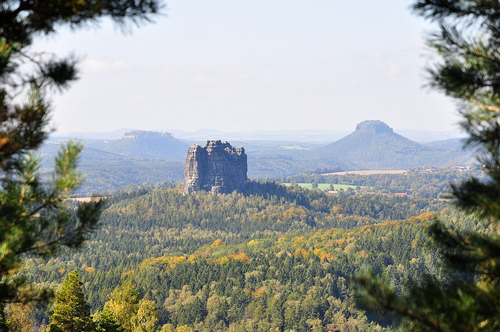
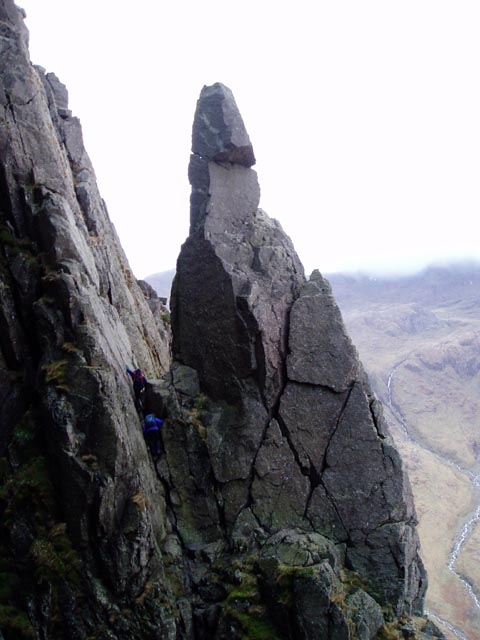
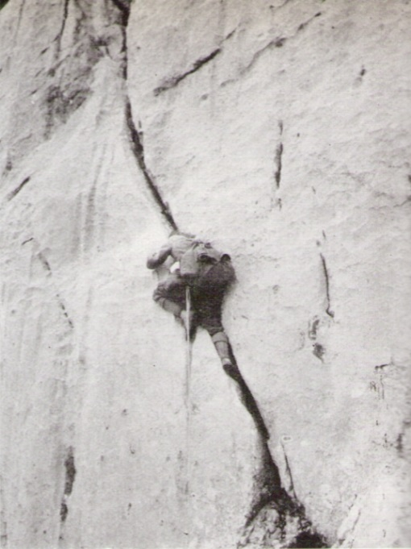
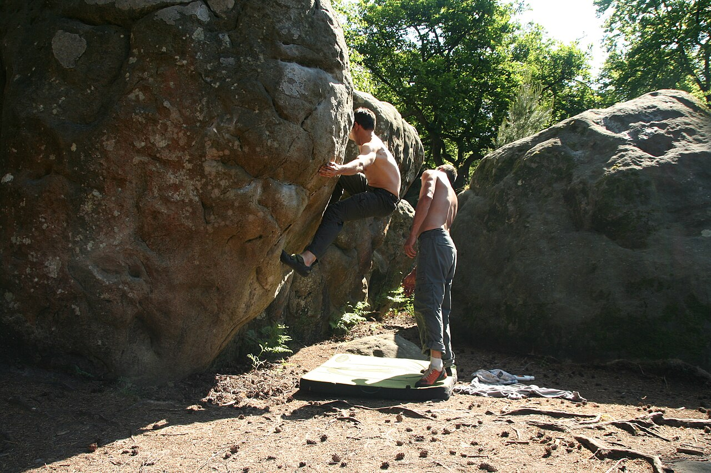
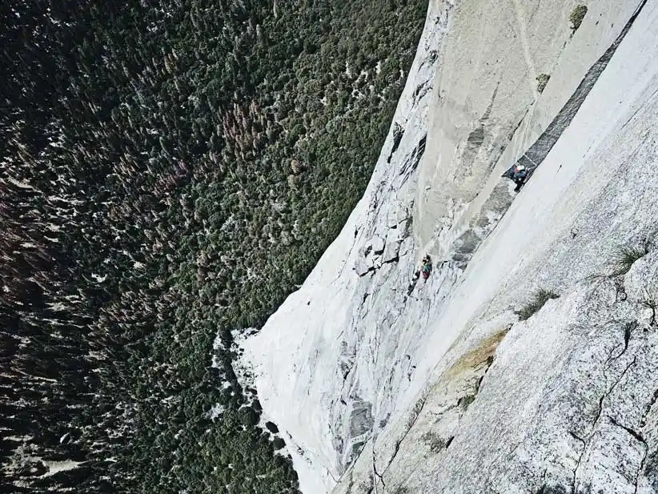
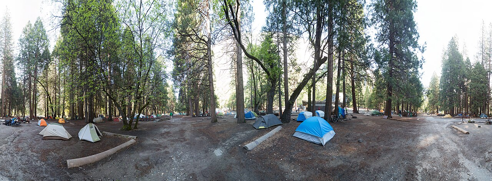
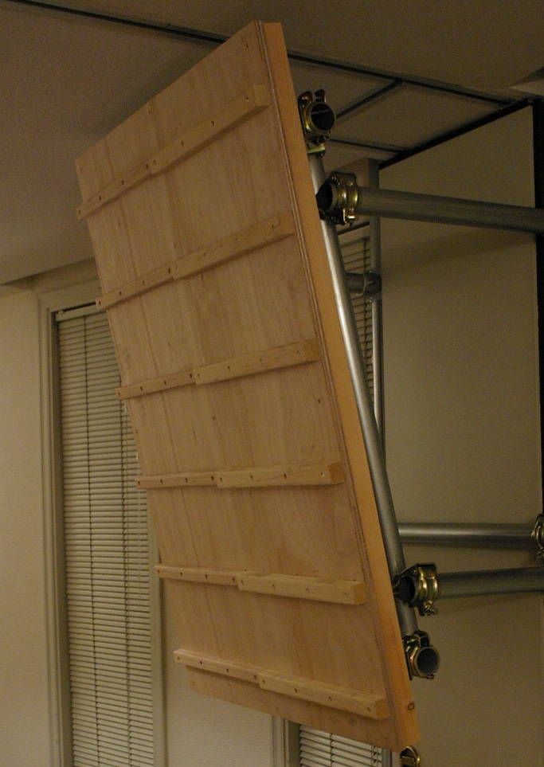
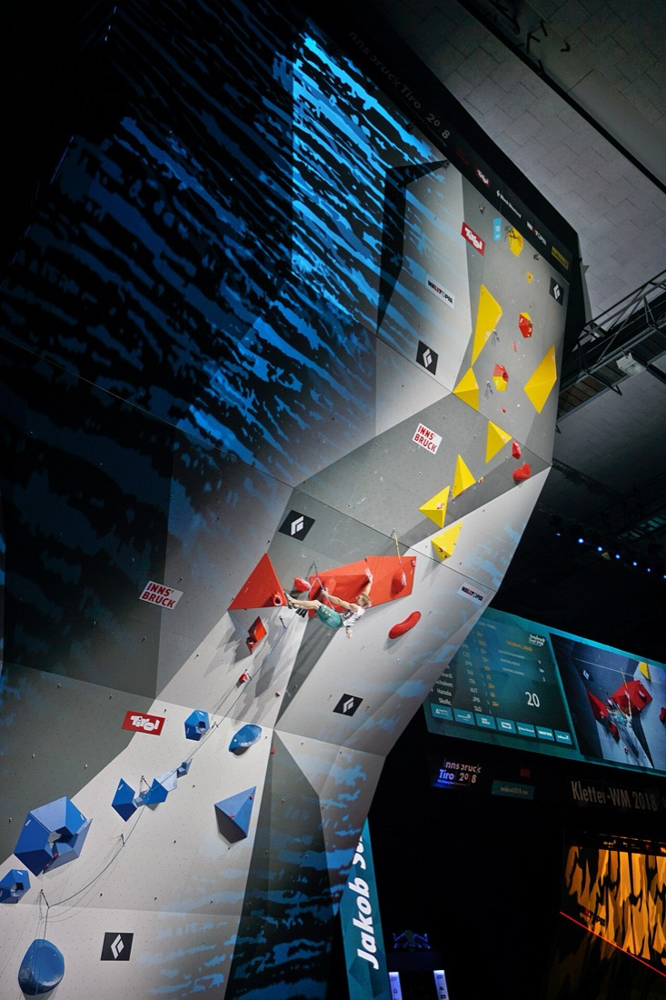

# 歴史と発祥

関連: [クライミングの種類](/basics/genres/) / [グレード](/basics/grades/) / [有名クライマー](/climbers/famous/) / [道具](/gear/) / [映画・ドラマ・アニメ・漫画](/references/media/)

クライミングは最初から「クライミング」だったわけではない。山頂に立つための手段だった岩登りが、手段であることをやめて、それ自体が目的になっていく。その過程で、**何を使ってよいか**（道具の倫理）と、**どこまで落ちてよいか**（リスクの引き受け方）が繰り返し問い直されてきた。研究の問い（なぜ怪我のリスクを引き受けてまで登るのか）は、150年前から当事者たちが議論してきたテーマでもある。

各節の末尾に出典番号を付け、一覧を[最後の節](#出典)にまとめた。裏が取れていない記述には（要確認）と書いてある。

---

## 1. 主な舞台

地名が国名なしで出てくると追いにくいので、先に並べておく。

| 国・地域 | 場所 | どんなところか |
|---|---|---|
| フランス／イタリア国境 | モンブラン | アルプス最高峰（4,808m）。ふもとの町はフランスのシャモニー |
| スイス | ヴェッターホルン | アルプス黄金時代の始まりとされる山 |
| スイス／イタリア国境 | マッターホルン | ツェルマット（スイス）側から登られた四角錐の岩峰 |
| ドイツ | エルベ砂岩山地（ザクセン） | ドレスデン近郊。低い砂岩の塔が林立する |
| ドイツ | フランケンユーラ | バイエルン州北部の石灰岩。レッドポイント発祥の地 |
| イギリス | 湖水地方 | イングランド北西部。ネイプス・ニードルがある |
| イタリア | ドロミテ | 東アルプスの石灰岩の山群 |
| オーストリア | カイザー山地／ゴザウカム | プロイスが登った岩場と、彼が墜死した山 |
| フランス | フォンテーヌブロー | パリ近郊の森に転がる砂岩。ボルダリングの聖地 |
| フランス | セユーズ | 南フランスの石灰岩。世界初の 9a+ のルートがある |
| アメリカ | ヨセミテ（カリフォルニア州） | エル・キャピタンなどの巨大な花崗岩の谷 |
| アメリカ | ティトン山脈（ワイオミング州） | ジョン・ギルが史上初の V8 を登った |
| オーストラリア | アラピレス | 世界初の 8b+ のルートがある岩場 |
| ノルウェー | フラタンゲル | 世界最難ルートが集まる海沿いの洞窟 |
| フィンランド | ラップノール | 世界初の V17 ボルダーがある |
| 日本 | 谷川岳（群馬・新潟県境） | 一ノ倉沢の岩壁。戦後の岩登りの主舞台 |
| 日本 | 城ヶ崎（静岡県・伊豆） | 海岸の岩場。最初からフリーの岩場として開拓された |
| 日本 | 小川山（長野・山梨県境） | 花崗岩のエリア。「エイハブ船長」がある |
| 日本 | 御岳（東京都青梅市） | 多摩川沿いのボルダー。「忍者返し」がある |

---

## 2. 年表

| 年 | できごと | 出典 |
|---|---|---|
| 1786 | モンブラン（仏伊国境）初登頂（8月8日、バルマ／パカール）。近代登山の起点とされる | [^montblanc] |
| 1854〜1865 | アルプス黄金時代。ヴェッターホルン（スイス）からマッターホルン（スイス／イタリア国境）まで | [^goldenage] |
| 1865 | マッターホルン初登頂（7月14日）。下降中に4名死亡 | [^matterhorn] |
| 1864 | ザクセン、ファルケンシュタインをバート・シャンダウの体操クラブが登る | [^saxon] |
| 1886 | イギリス湖水地方、ネイプス・ニードルをハスケット・スミスが単独初登 | [^hist] |
| 1897 | フランス山岳会の会員がフォンテーヌブローの岩で練習を始める | [^hist] |
| 1911 | パウル・プロイスがピトン論争（マウアーハーケンシュトライト）を起こす | [^preuss] |
| 1913 | ザクセンのルールがフェーアマンのガイドブックで初めて活字になる | [^saxon] |
| 1934-35 | ピエール・アランがフォンテーヌブローで活躍、ゴムを貼ったシューズを作る | [^hist] |
| 1958 | ジョン・ギルがチョークを持ち込む。史上初の V8 課題 | [^hist] |
| 1958 | エル・キャピタン「The Nose」初登（ハーディング、延べ45日） | [^nose] |
| 1960 | The Nose 第2登。固定ロープを使わず7日連続 | [^nose] |
| 1971-72 | クリーンクライミングの提唱。シュイナード社のカタログ | [^clean] |
| 1975 | クルト・アルバートがフランケンユーラで最初の赤丸を塗る → **レッドポイント** | [^redpoint] |
| 1978 | レイ・ジャーディンがカム（フレンズ）を発売 | [^hist] |
| 1985 | イタリア・バルドネッキアで初の国際コンペ（Sportroccia）。同年、世界初の 8b+ | [^comp] [^gullich] |
| 1988-89 | UIAA が競技を統括。**屋内人工壁**での開催が決まる | [^comp] |
| 1989 | 第1回クライミング・ワールドカップ（全7戦） | [^comp] |
| 1991 | Action Directe（世界初の 9a）。キャンパスボードの発明 | [^gullich] |
| 1993 | リン・ヒルが The Nose をフリーで登る（翌1994年に1日で） | [^nose] |
| 2001 | 世界初の 9a+（Realization、シャーマ） | [^fa] |
| 2006-07 | IFSC が UIAA から独立 | [^comp] |
| 2016 | 世界初の 9A（V17）ボルダー、Burden of Dreams | [^burden] |
| 2017 | エル・キャピタン「Freerider」フリーソロ（6月3日）。Silence（9c、9月3日） | [^honnold] [^fa] |
| 2020(21) | 東京オリンピックでスポーツクライミングが初採用 | [^comp] |

---

## 3. 前史 — 登るのは山頂のためだった

ヨーロッパで山に登る行為が娯楽・探求として成立したのは18世紀末から。1786年8月8日、フランスとイタリアの国境にそびえるアルプス最高峰**モンブラン**が初登頂される（ジャック・バルマとミシェル＝ガブリエル・パカール）。これが近代登山の起点とされる。この登頂を仕掛けたのは懸賞金を出した博物学者ド・ソシュールだった[^montblanc]。19世紀半ばには**アルプス黄金時代**と呼ばれる初登頂競争が起きる。スイスの**ヴェッターホルン**が登られた1854年から、スイスとイタリアの国境にある**マッターホルン**が登られた1865年までの十数年を指す[^goldenage]。

1787年8月、ド・ソシュールのモンブラン登頂。案内したのは前年に初登頂したジャック・バルマだった — Christian von Mechel（1790年） / <a href="https://commons.wikimedia.org/wiki/File%3ADescent_from_Mont-Blanc_in_1787.jpg">Wikimedia Commons</a> / パブリックドメイン

この時代、岩壁は「山頂に到達するために越えなければならない障害」だった。岩登りの技術は目的ではなく手段だった。

### マッターホルンの事故（1865年）

1865年7月14日、エドワード・ウィンパーら7人がマッターホルンに初登頂する。その下降中、1人の滑落が連鎖し、ロープが切れて4人（クロー、ハドウ、ハドソン、ダグラス）が墜死した。ダグラスの遺体は見つかっていない[^matterhorn]。

事故から3週間後、『ル・モンド・イリュストレ』1865年8月5日号に載った挿絵。ロープが切れて4人が落ちていく場面を描いている — Jules Férat ほか / <a href="https://commons.wikimedia.org/wiki/File%3ACatastrophe_arriv%C3%A9e_le_14_juillet_au_mont_Cervin_%28Alpes_Italiennes%29._%28D%E2%80%99apr%C3%A8s_le_croquis_de_M._Pajot.%29.png">Wikimedia Commons</a> / パブリックドメイン

登頂の成功と4人の死が同じ日に起きたことで、「なぜそんなことをするのか」が公衆から突きつけられた。

- 『タイムズ』は7月27日と8月9日に事故をめぐる論説を掲げ、それに続いて登山家たちの投書が並んだ[^ajaftermath]
- 事故は各国の新聞が報じ、それまでのアルプスのどの出来事よりも大きく扱われた[^famatterhorn]
- ヴィクトリア女王は、登山は禁じられるべきだと述べたとされる[^famatterhorn]

**危険が可視化されたあと、その活動がどうなるか**は、研究上の起点になりうる論点。少なくともこの事故がクライミングを終わらせることはなかった。現代のフリーソロ映像の受容とも重ねて考えられる。

---

## 4. 岩登りの独立（1860年代〜1910年代）

「山頂に立つ」という目的から切り離され、**登ること自体を味わう**行為として岩登りが分化していく。性格の違う3つの地域で、ほぼ同時期に起きた。

### 4-1. ザクセン（ドイツ・エルベ砂岩山地）

低い砂岩の塔が林立する地域。標高が低く、山頂に立つこと自体には意味がない。だから「どう登ったか」だけが価値になった。

- 1864年、バート・シャンダウの体操クラブの面々によるファルケンシュタイン登攀が近代の起点とされる[^saxon]
- **極めて厳しいローカルルール**が早くから成文化され、1913年にルドルフ・フェーアマンのガイドブックで初めて活字になった[^saxon]
  - チョーク（および松脂）の使用禁止
  - 人工的な補助手段の禁止
  - ナッツ・カムの類も禁止（支点はリングボルトとスリングのみ）
- 結果として「支点間が極端に遠い」「落ちてはいけない」登りが今も残る

エルベ砂岩山地のファルケンシュタイン。山頂に立つこと自体には意味がない、独立した砂岩の塔 — Tobi 87 / <a href="https://commons.wikimedia.org/wiki/File%3AFalkenstein-S%C3%A4chsische_Schweiz.jpg">Wikimedia Commons</a> / <a href="https://creativecommons.org/licenses/by-sa/3.0">CC BY-SA 3.0</a>

**現代のフリークライミング倫理の源流**。何を使ってよいかを先に決め、その制約の中で難度を上げるという発想はここから来ている。

### 4-2. イギリス湖水地方（イングランド北西部）

1886年、ハスケット・スミスが独立した岩塔ネイプス・ニードル（約21m、V Diff）をロープなし単独で登った。これが英国における「スポーツとしてのクライミングの誕生」とされる[^hist]。

ネイプス・ニードル。1886年にハスケット・スミスがロープなし単独で登った — Blisco / <a href="https://commons.wikimedia.org/wiki/File%3ANapes_Needle.jpg">Wikimedia Commons</a> / <a href="http://creativecommons.org/licenses/by-sa/3.0/">CC BY-SA 3.0</a>

- 岩に穴を開けない（ボルトを打たない）文化が確立
- のちの[トラッドクライミング](/basics/genres/)と、危険度を別建てで示す[英国式グレード](/basics/grades/)につながる

### 4-3. ドロミテ（イタリア）／東アルプス — ピトン論争

1911年、パウル・プロイスが論考「アルプスのルートにおける人工的補助手段」を発表し、**マウアーハーケンシュトライト（ピトン論争）**が起きる[^preuss]。

彼の主張の核心:

- 登攀者は山の困難に「等しい」のではなく「勝る」能力を持つべき
- **自分でクライムダウンできない登りはするべきでない**
- 人工的な補助手段が正当化されるのは、差し迫った危険のときだけ
- ロープは助けにはなるが、それがなければ不可能な登攀を可能にするために使うものではない

1911年、オーストリア・カイザー山地のトーテンキルヒルを登るプロイス — Walter Schmidkunz / <a href="https://commons.wikimedia.org/wiki/File%3APaul_Preuss_im_Schiefen_Riss_am_Totenkirchl.jpg">Wikimedia Commons</a> / パブリックドメイン

「人工的な補助具によって、あなた方は山を機械仕掛けの玩具に変えてしまった」という言葉が残っている[^preuss]。

プロイスは1913年10月3日、オーストリアのマンドルコーゲル北稜を単独フリーで登攀中に300m以上墜落して死亡した。27歳。遺体は10日間見つからなかった[^preuss]。

**「安全装備は難度を下げる道具ではない」という原則**は現代のフリークライミングに引き継がれている。一方で、倫理の純度を上げた本人が墜死したという事実も同時に残った。

---

## 5. ボルダリングの発生

### 5-1. フォンテーヌブロー（フランス）

パリ近郊の森に転がる砂岩のブロック群。1897年頃、フランス山岳会の会員がアルプス登山の練習場として使いはじめ、やがてそれ自体が目的になっていく[^hist]。

フォンテーヌブローの森の砂岩。下にマットを敷き、もう1人がスポットに付く現在のボルダリングの形 — Jerome Bon（2014年） / <a href="https://commons.wikimedia.org/wiki/File%3AEscalade_%C3%A0_Fontainebleau_%2814235729356%29.jpg">Wikimedia Commons</a> / <a href="https://creativecommons.org/licenses/by/2.0">CC BY 2.0</a>

- **ピエール・アラン**が1934年に L'Angle Allain（5C）を登り、ボルダリングを主張した
- 1935年、テニスシューズの側面にゴムを貼ったシューズを作る。専用の靴という発想の始まり[^hist]
- 1979年、スペインのボレアル社が「スティッキーラバー」のシューズ Firé を発売し、摩擦そのものが変わった[^hist]
- 独自のグレード体系（[Fontグレード](/basics/grades/)）と、色分けされたサーキット文化が生まれた

### 5-2. ジョン・ギル（アメリカ）

体操競技出身。ボルダリングを「登山の練習」から切り離し、**強度と身体制御を追求する独立した領域**として確立した。

- 1958年、体操用の**チョーク**をボルダリングに持ち込む。以後クライミングの標準装備になった[^hist]
- 同じ1958年、アメリカ・ワイオミング州のティトン山脈にある Gill Right Problem で史上初の V8 を登る[^hist]
- ダイナミックムーブを積極的に取り入れた
- 1950年代に **B1／B2／B3** という3段階の難度表記を提案した。ボルダリング専用としては最初期の体系で、主観的な2段階と客観的な1段階からなり、当時と将来のフリークライミングの水準を基準にしていた[^gill]
- 20年後にスポートクライミングが広まると3段階の前提が崩れ、上限のないVスケールに取って代わられた[^gill]

ボルダリングが世界的な主流になるのは2000年代以降だが、思想的な土台はここで作られている。

---

## 6. ヨセミテ（1950〜1970年代）

アメリカ・カリフォルニアの巨大な花崗岩の谷。ここで起きたことが、その後のクライミング全体の価値観を決めた。

### 6-1. 大岩壁とスタイル論争

1958年、ウォーレン・ハーディングらがエル・キャピタンの「The Nose」を初登する。ヒマラヤ遠征と同じく camp を固定ロープで結ぶ方式（シージ戦術）で、**600本のピトンと125本のボルト**を使い、延べ45日を要した。最後の突き上げでは15時間かけて28本のボルトを打った[^nose]。

1960年、ロイヤル・ロビンス、ジョー・フィッチェン、チャック・プラット、トム・フロストが、固定ロープを使わず**7日連続**で第2登した[^nose]。

The Nose を登るクライマー。1958年の初登には延べ45日、ピトン600本とボルト125本が使われた — Andy Kirkpatrick / <a href="https://commons.wikimedia.org/wiki/File%3AThe_Nose_El_Capitan.webp">Wikimedia Commons</a> / <a href="https://creativecommons.org/licenses/by/4.0">CC BY 4.0</a>

到達は同じでも、やり方が違えば別の行為である——**「登れたかどうか」ではなく「どう登ったか」で評価する**価値観が、この対比から決定づけられた。

### 6-2. カウンターカルチャーとしてのクライマー

1960〜70年代、谷に住み着いて登り続ける集団（キャンプ4）が生まれた。定職に就かず、最低限の金で暮らし、登ることだけを中心に生活を組む。この時期を扱ったのがドキュメンタリー [Valley Uprising](/references/media/)。

ヨセミテ渓谷のキャンプ4。ここに住み着いたクライマーたちが1960〜70年代の中心にいた — Diliff / <a href="https://commons.wikimedia.org/wiki/File%3ACamp_4%2C_Yosemite_NP%2C_CA%2C_US_-_Diliff.jpg">Wikimedia Commons</a> / <a href="https://creativecommons.org/licenses/by-sa/3.0">CC BY-SA 3.0</a>

→ 研究上重要。**クライミングが生き方の選択として語られる**構図は、ここで大きく作られている。

### 6-3. クリーンクライミング（1971〜72年）

ピトンの打ち込みと回収を繰り返すと、岩に恒久的な傷が残る。人気ルートほど破壊が進んだ。

- 1971年、ジョン・スタナードが「クリーンクライミング」という語を用い、ピトンのない未来を構想する[^clean]
- 1972年、シュイナード・イクイップメント社のカタログにダグ・ロビンソンの論考「The Whole Natural Art of Protection」と、シュイナード＆トム・フロストによる環境への論考が載る。道具メーカー自身がピトンからの脱却を呼びかけた[^clean]
- 1978年、レイ・ジャーディンがカム（フレンズ）を発売し、回収できる支点で登れる範囲が一気に広がった[^hist]

「岩を残す」という価値が倫理に加わった。

### 6-4. フリー化

1970年代後半から、人工登攀で越えていた部分を**フリーで登り直す**動きが加速する。既に登られたルートを、より厳しいスタイルで登り直すことが新しい達成になった。

この流れの到達点が、1993年の[リン・ヒル](/climbers/famous/lynn-hill/)による The Nose のフリー化。翌1994年には23時間で1日フリー登攀を成し遂げた[^nose]。初登から35年後に、同じ壁が別の行為として登り直された。

---

## 7. レッドポイントとスポートクライミング（1970〜80年代）

### 7-1. 赤い点（ドイツ・フランケンユーラ）

クルト・アルバートは、ルートに残置されたピトンやフックを1つずつ赤い×で消し、それら全部に頼らずルート全体をフリーで登れたとき、ルートの基部に**赤い丸**を塗った。これが **Rotpunkt（レッドポイント）** の語源になる[^redpoint]。

- 最初の Rotpunkt は1975年、フランケンユーラの Streitberger Schild にある人工登攀ルートを 6a+ でフリー化したもの[^redpoint]
- 「事前に何度も練習してよいが、最終的に一度も休まず・支点に頼らず登り切る」というスタイルの定義
- 達成の単位が「初めて登る」から「完成させる」に変わった

### 7-2. ボルトとスポートクライミング

同時期のフランスで、上から下降しながらボルトを設置するスタイルが広まる。ジャン＝クロード・ドロワイエが「自然の造形のみをホールド・スタンスにする」ことを提唱し、広く受け入れられた[^jafree]。

- **落ちることを前提に設計されたルート**が成立した
- 「落ちたら死ぬ」から「落ちても大丈夫、だから限界まで試せる」への転換
- 危険の管理と難度の追求が分離した

怪我・リスクを考えるうえで決定的な分岐点。スポートクライミングでは、**リスクを下げることが難度を上げる手段**になった。以降のクライミング人口の増加はほぼこの形式が担っている。

### 7-3. 難度の更新

[ヴォルフガング・ギュリッヒ](/climbers/famous/wolfgang-gullich/)は1985年にオーストラリアのアラピレスで Punks in the Gym（史上初の 8b+）、1987年にフランケンユーラで Wallstreet（史上初の 8c）、1991年に Action Directe（史上初の 9a）を登った。Action Directe のトレーニング中に考案した**キャンパスボード**は、現在もほぼすべてのジムにある[^gullich]。

キャンパスボード。桟だけを指で持って足を使わずに登り降りする。ギュリッヒが Action Directe のために考案した — Akira Kamikura / <a href="https://commons.wikimedia.org/wiki/File%3ACampus_board_wood.jpg">Wikimedia Commons</a> / <a href="https://creativecommons.org/licenses/by/2.0">CC BY 2.0</a>

| 年 | 到達 | ルート／課題 | 場所 | 初登者 |
|---|---|---|---|---|
| 1985 | 8b+（5.14a） | Punks in the Gym | アラピレス（オーストラリア） | ギュリッヒ[^gullich] |
| 1987 | 8c（5.14b） | Wallstreet | フランケンユーラ（ドイツ） | ギュリッヒ[^gullich] |
| 1991 | 9a（5.14d） | Action Directe | フランケンユーラ（ドイツ） | ギュリッヒ[^fa] |
| 2001 | 9a+（5.15a） | Realization | セユーズ（フランス） | シャーマ[^fa] |
| 2008 | 9b（5.15b） | Jumbo Love | クラーク山（アメリカ） | シャーマ[^fa] |
| 2012 | 9b+（5.15c） | Change | フラタンゲル（ノルウェー） | オンドラ[^fa] |
| 2017 | 9c（5.15d） | Silence | フラタンゲル（ノルウェー） | オンドラ[^fa] |
| 2016 | 9A（V17、ボルダー） | Burden of Dreams | ラップノール（フィンランド） | フッカタイバル[^burden] |

難度の更新には、**トレーニング法の発明**と**人工壁の普及**が常にセットで効いている。身体が強くなったというより、身体を鍛える方法が発明されたという見方もできる。

---

## 8. 競技化とオリンピック

- 1985年、イタリア・バルドネッキアで最初の国際的なコンペ Sportroccia が開かれる。のちの Rock Master。初期の優勝者はステファン・グロヴァッツ、パトリック・エドランジェ、カトリーヌ・デスティベル[^comp]
- 当初のコンペは**自然の岩場で行われるリード競技**だった[^comp]
- 1988〜89年、フランス連盟の働きかけで UIAA が競技を統括することになり、**屋内の人工壁で開催する**ことが合意された[^comp]
- 1989年、第1回ワールドカップが世界7戦で開催[^comp]
- 2006〜07年、UIAA から **IFSC**（国際スポーツクライミング連盟）が独立[^comp]
- 2020東京大会（実施は2021年）でオリンピック初採用。ボルダー・リード・スピードの**複合**1種目という一度限りの方式[^comp]
- パリ2024から「ボルダー＆リード」と「スピード」の2種目に分離[^comp]

2018年世界選手権（インスブルック）リード決勝。岩場から切り離された、条件を揃えて競うための壁 — Simon Legner / <a href="https://commons.wikimedia.org/wiki/File%3AClimbing_World_Championships_2018_Lead_Final_Schubert_08.jpg">Wikimedia Commons</a> / <a href="https://creativecommons.org/licenses/by-sa/4.0">CC BY-SA 4.0</a>

人工壁への移行は、クライミングを「自然を相手にする行為」から「条件を揃えて競う競技」に変えた。同時に、岩場に一度も行かないクライマーが成立する条件を作った。

→ [イベント / 大会](/events/competitions/)

---

## 9. 日本のクライミング史

### 9-1. 近代登山の輸入（明治）

イギリス人宣教師ウォルター・ウェストンが1888年に来日し、日本の高山に登ってロンドンで『日本アルプス 登山と探検』を著した。1903年に岡野金次郎がこれを見つけ、小島烏水に伝える。ウェストンの助言を受けて、**1905年10月14日**、小島烏水・高頭仁兵衛・武田久吉ら7名の発起人により日本山岳会が設立された。初代会長は小島、当初の会員は約390名[^jac]。

### 9-2. 岩登りの時代（戦後〜1970年代）

- 1931年、清水トンネルを含む上越線が全通し、谷川岳が首都圏から夜行列車で日帰りできる山になる。剱岳・穂高岳に劣らない急峻な岩壁が大学山岳部や社会人登山家に好まれ、戦争による中断を挟んで、クライマーを中心とした登山ブームが1960年代まで続いた[^tanigawa]
- 谷川岳の遭難統計は1931年から取られており、**2012年までの死者は805名**[^tanigawa]
- 山岳会という**組織**が技術継承と安全管理の単位だった。師弟関係、合宿、遭難対策

谷川岳・一ノ倉沢。戦後の日本の岩登りの主舞台であり、1980年にここでフリー化が起きた — Kumpei Shiraishi / <a href="https://commons.wikimedia.org/wiki/File%3AIchinokura-sawa_%2825084338898%29.jpg">Wikimedia Commons</a> / <a href="https://creativecommons.org/licenses/by/2.0">CC BY 2.0</a>

### 9-3. フリークライミングの導入（1980年代）

戦後しばらくは、1956年のマナスル登頂を頂点に、ヒマラヤの未踏峰に登ることが至高とされていた。次いで社会人山岳会による岩壁登攀が主流になる。

ところが、難所を安易にボルトで越える風潮が広がると、国内の岩壁は**「どこへ行っても6級A1」**という言葉で言い表される行き詰まりに入る。どの岩場に行っても、限界まで登ってあとはボルトによる人工登攀（A1）で突破する、という同じ形になってしまい、ルートごとの違いが消えた。クライマーの目は、次第に近郊の岩場でのフリークライミングへ移っていく[^jafree]。

- **1980年**、戸田直樹・加藤泰平が谷川岳一ノ倉沢コップ状岩壁正面壁・雲表ルートをフリー化する。この行き詰まりに穴を開け、各地で起きていたフリークライミングの動きを大きなうねりに変えるだけのインパクトがあった[^jafree]
- この時期に檜谷清、池田功、南場亨祐、森徹也らが活躍した[^jafree]
- **1981年**から城ヶ崎（伊豆）の海岸の岩場が開拓される。1981年1月、ヨセミテから帰国したばかりの檜谷清がフリークライミングの対象として訪れたのが最初。**初めからフリークライミングの岩場として扱われた**点が古典的なゲレンデと決定的に違う[^jogasaki]
- 1987年のシーサイドカップ開催を機に、城ヶ崎でボルトによるフェイスルートが次々に拓かれた[^jogasaki]
- 1987年からジャパンカップが開催される[^jafree]
- 1990年代初頭、堀地清次・寺島由彦らホールド制作や人工壁運営を担う世代と、杉野保・[平山ユージ](/climbers/famous/yuji-hirayama/)ら若い世代が入りまじって競い合った[^jafree]

### 9-4. 段級グレードと御岳

- **段級グレード**は[草野俊達](/climbers/famous/toshitatsu-kusano/)が考案し、1995年の『岩と雪』最終号（169号）の「日本ボルダリング紀行 石の人」で発表された[^cngrade] [^micki]
- 御岳（東京都青梅市）の「忍者返し」と小川山の「エイハブ船長」がともに**1級の基準**とされた[^micki]
- 御岳は池田功らによって開拓され、草野俊達が「蟹」「虫」などの高難度課題を初登した。室井登喜男のガイド『小川山 御岳 三峰 ボルダー図集』（通称「黒本」）によって広く知られるようになった[^micki]

→ 換算表は [グレード](/basics/grades/)

### 9-5. 国際舞台とジムの時代

- 1997年、平山ユージがヨセミテのサラテ・ルートをフリーで登り、ほぼ全ピッチをオンサイトする[^jafree]
- 1998年、平山がワールドカップで**日本人初のシリーズ総合優勝**を達成[^jafree]
- クライミングジムは**2008年に100施設以下だったものが、2015年には約4倍の435施設**に増えた（日本山岳・スポーツクライミング協会調べ）。競技人口は60万人を超えるとの推定もある[^wonder]
- 2021年の東京オリンピックで一般層に一気に届く。[楢崎智亜](/climbers/famous/tomoa-narasaki/)・[野口啓代](/climbers/famous/akiyo-noguchi/)・[野中生萌](/climbers/famous/miho-nonaka/)らが広く知られるようになった

現在の日本のクライマーの多数派は、**岩場を経由せずジムから入った層**とみられる（正確な内訳は要確認）。これは歴史的にはごく新しい状態で、動機・身体観・リスクの捉え方が上の世代とは別物になっている可能性が高い。

---

## 10. 歴史から見える論点

### 10-1. 制約は自分たちで作ってきた

技術が進歩すれば、より簡単に登れるようになるはずだった。だが歴史は逆で、**使える道具を自ら制限し続けてきた**。

- ザクセンのチョーク・カム禁止（1913年に成文化）
- プロイスのピトン批判（1911年）
- クリーンクライミング（1971-72年）
- エイドで登れたルートをフリーで登り直す（1970年代〜）

登ることの価値は「登れた」ことではなく「どういう条件で登ったか」にある。これは怪我のリスクの引き受け方とも直結する。**難しさを守るために、危険を残す選択**が繰り返されてきた。

### 10-2. 危険は減ったのか

道具の面では大きく減った。カム、ボルト、マット、ダイナミックロープ、ビレイデバイスは、いずれも致命的な事故の確率を下げた。

だが同時に、

- 落ちても大丈夫になったことで、**落ちる回数が桁違いに増えた**
- トレーニング法の発達で、**慢性的な障害**（指・肘・肩）が新しい怪我の主流になった
- 死ぬ事故は減り、**壊れる身体は増えた**という見方ができる

この対比自体はまだ数字で裏を取れていない。統計は [クライミングと怪我](/training/climbing-and-injury/) 側で詰める。

### 10-3. 「なぜ登るのか」は昔から問われている

マッターホルンの事故以来、クライマーは常に外部から「なぜ危険を冒すのか」と問われ、そのつど説明を試みてきた。プロイス、ヨセミテの世代、フリーソロの現代——**説明の言葉自体が時代ごとに違う**。この語彙の変遷そのものが、インタビューで聞く「なぜ続けるのか」の答えを枠づけている可能性がある。

---

## 11. 未解決の問い

- ジム世代のクライマーは、こうした歴史をどの程度知っているか。知らないまま倫理（レッドポイント、完登の定義）だけを受け継いでいるのではないか
- 「スタイルを守る」という価値観は、怪我のリスクを引き受ける態度とどうつながっているか
- 日本の山岳会文化（組織・師弟・遭難対策）と、現在のジム文化（個人・SNS・自己責任）の断絶はどこで起きたか
- オリンピック採用は、クライマーの自己認識をどう変えたか
- 歴史を知るクライマーと知らないクライマーで、怪我の語り方は変わるか

---

## 今後あたる資料

このページはいまのところ Wikipedia と雑誌サイトに頼っている。厚みを出すために当たる先は [参考資料 / 資料](/references/materials/) にまとめた。『岩と雪』全169号、菊地敏之『定本 我々はいかに「石」にかじりついてきたか』、早稲田の修士論文の3件。

---

## 出典

最終参照日: 2026-09-22。

画像はすべて Wikimedia Commons から。撮影者・ライセンスは各画像のキャプションに書いた。

[^montblanc]: Wikipedia (en), "Mont Blanc". <https://en.wikipedia.org/wiki/Mont_Blanc>

[^goldenage]: Wikipedia (en), "Golden age of alpinism". <https://en.wikipedia.org/wiki/Golden_age_of_alpinism>

[^matterhorn]: Wikipedia (en), "Matterhorn". <https://en.wikipedia.org/wiki/Matterhorn>

[^ajaftermath]: D. F. O. Dangar and T. S. Blakeney, "The Matterhorn: A Diary of Events after the Disaster of 1865", *Alpine Journal*, 1965, pp. 199-204. <https://www.alpinejournal.org.uk/Contents/Contents_1965_files/AJ%201965%20199-204%20Dangar%20Blakeney%20Matterhorn.pdf>

[^famatterhorn]: Wikipedia (en), "First ascent of the Matterhorn". <https://en.wikipedia.org/wiki/First_ascent_of_the_Matterhorn>

[^saxon]: Wikipedia (en), "Saxon Switzerland climbing region". <https://en.wikipedia.org/wiki/Saxon_Switzerland_climbing_region>

[^gill]: Wikipedia (en), "John Gill (climber)". <https://en.wikipedia.org/wiki/John_Gill_(climber)>

[^hist]: Wikipedia (en), "History of rock climbing". <https://en.wikipedia.org/wiki/History_of_rock_climbing>

[^preuss]: Wikipedia (en), "Paul Preuss (climber)". <https://en.wikipedia.org/wiki/Paul_Preuss_(climber)>

[^nose]: Wikipedia (en), "The Nose (El Capitan)". <https://en.wikipedia.org/wiki/The_Nose_(El_Capitan)>

[^clean]: Wikipedia (en), "Clean climbing". <https://en.wikipedia.org/wiki/Clean_climbing>

[^redpoint]: Wikipedia (en), "Redpoint (climbing)". <https://en.wikipedia.org/wiki/Redpoint_(climbing)>

[^gullich]: Wikipedia (en), "Wolfgang Güllich". <https://en.wikipedia.org/wiki/Wolfgang_G%C3%BCllich>

[^fa]: Wikipedia (en), "List of first ascents (sport climbing)". <https://en.wikipedia.org/wiki/List_of_first_ascents_(sport_climbing)>

[^burden]: Wikipedia (en), "Burden of Dreams (climb)". <https://en.wikipedia.org/wiki/Burden_of_Dreams_(climb)>

[^comp]: Wikipedia (en), "Competition climbing". <https://en.wikipedia.org/wiki/Competition_climbing>

[^honnold]: Wikipedia (en), "Alex Honnold". <https://en.wikipedia.org/wiki/Alex_Honnold>

[^jac]: Wikipedia (ja)「日本山岳会」<https://ja.wikipedia.org/wiki/日本山岳会>

[^jafree]: Wikipedia (ja)「フリークライミング」<https://ja.wikipedia.org/wiki/フリークライミング>

[^tanigawa]: Wikipedia (ja)「谷川岳」<https://ja.wikipedia.org/wiki/谷川岳>

[^jogasaki]: CLIMBING-net（山と溪谷社）「城ヶ崎」岩場詳細。<https://www.climbing-net.com/iwaba_detail/城ヶ崎/> → [参考資料 / サイト](/references/websites/)

[^cngrade]: CLIMBING-net（山と溪谷社）「今さら聞けない疑問を解決 vol.1 グレードってだれが決めるの？」<https://www.climbing-net.com/general/今さら聞けない疑問を解決-vol-1　グレードってだれが決めるの/>

[^micki]: Mickipedia「ボルダリング『三大クラシック課題』の初出や由来を探る」<https://micki-pedia.com/origin-of-3-major-classic-boulders.html> → [参考資料 / サイト](/references/websites/)

[^wonder]: THE WONDER「スポーツクライミングの競技人口は？ 人気上昇中の競技の魅力」（日本山岳・スポーツクライミング協会調べの数値を引用）<https://thewonder.it/article/199/description/>
