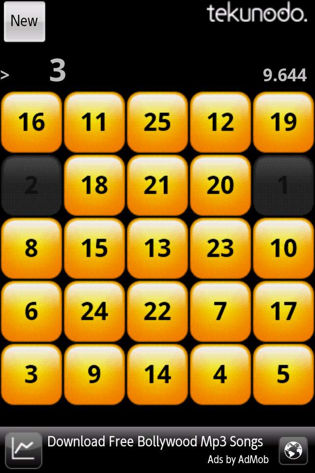
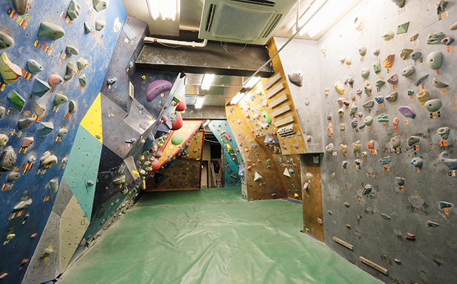

# インターン先の上司がクライマー

大学院修士1年生の春頃、同級生の優秀な学生は軒並み開発のインターンを通して、技術力や実務経験を得ていた。

研究職希望で就活を控えているわけではない自分は、そこまでその必要性を感じるシチュエーションではなかったが、
自分も流石にそれを経験していないのはまずいなと感じてインターンを探していた。

当時はスマートフォンが少しずつ普及し始め、カジュアルゲームでもリリースすればある程度話題になるアプリ開発の黎明期だった。
その頃、Touch the numbersというカジュアルゲームで伸びていたtekunodo.という会社が学生インターンを募集していたので、応募して面接し無事に働くことができた。

最低賃金900円くらいの時代に時給1000円で、開発のバイトにしては安かった。しかし、経験が積めるならいいだろうということで、朝刊の新聞配達のバイトをやめてそこで働くことにした。

毎週水曜日だけフルタイムで働き、新しいカジュアルゲームを作るという内容だった。いくつかのアプリのデモを作ってみたうち、評価が良かった戦車のアクションゲームの開発を進めることになった。

その会社は社員7人、あとは学生のアルバイト10人前後という小さな会社だった。その開発責任者に当たる[内村さん](/climbers/people/uchimura/)という方がよくしてくれたのだが、話を聞いてみるとその方もクライミングをしているということだった。小さなオフィスの一角に懸垂マシンを設置して、これでいつでもトレーニングできるとはしゃいでいる、童心を持った優しい人だった。

仕事を19時に終え、そのあと中野の[J&S](/places/gym/j-and-s/)というクライミングジムに一緒に行くのが習慣になった。内村さん、内村さんの奥様、親会社の営業担当のAさんと自分の4人で、毎週のように通った。

内村さんとはクライミングを通して親密な関係になれたが、一方、インターンとしてはあまり順調ではなかった。
1か月くらい働いてみて、会社としての力もエンジニアとしての力も大して強い組織ではないことがわかってきた。結果的に、開発していたゲームもリリースすることはなく、僕はフェードアウトという形で退職することとなった。

そこでの人間関係を深く構築することに大きな恩恵は感じていなかったが、クライミングが人との距離をプライベートな方向に縮めるものだということを、このとき実感した。よくタバコをコミュニケーションのきっかけにすると言う人がいるが、ある意味同じことなのかもしれない。
