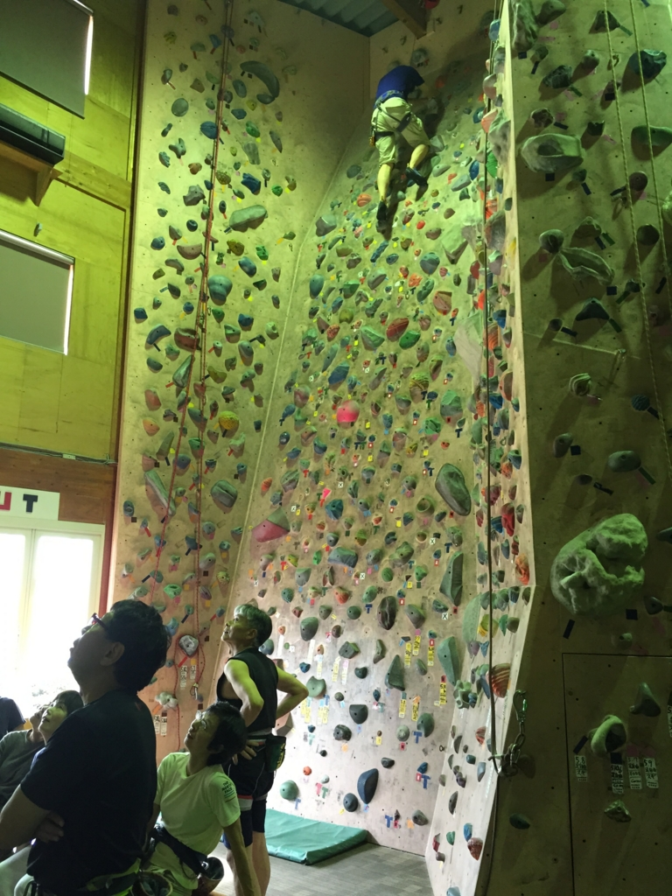

# ゼミの後輩がクライマー

クライミングを始めて半年くらい経った頃、自分は大学院1年になっていた。

当時通っていた農工大の工学部情報工学科では、学部4年生+大学院生は興味のある分野と教授を選び、研究室に入る仕組みだった。
研究室で初めての後輩が入ってきて自己紹介のプレゼンを聞いていると、一人[伊藤朋（いとうたから）](/climbers/people/tomo/)という男の子がフリークライミングが趣味だと言っていた。

彼は一言で言うと、「よく喋る人当たりのいいお調子もの」という感じだった。しかし一方で上下関係の意識がしっかりしているのか、上級生や先生には必ず敬語で、よく喋りかけてくれた。

話していると、朋君は大学を入り直しており、僕より1つ年上だということがすぐに分かった。
「朋くん、僕とおないか年上だよね。敬語使わなくていいよ」と言ったのだが、「いえ、そこは先輩後輩なので！」とさらっと返していたところに、人間力の高さを感じてしまった。

> 向こうのスタンスを尊重するために僕はタメ語で話し続けたが、その器用な振る舞い、実際に年上だというところから僕は尊敬の念を持たずにはいられなかった。朋くんとはその後大学を辞めるまでクライミング仲間で毎週一緒に登る関係になるのだが、「お互い先輩」という意識で話していたのが、いい関係が続いた理由かもしれないと思う。

クライミングの話をしていると「ボルダリングしかやったことないなら、リードも一度やってみてください。楽しいですよ」と言われ、初めて一緒に登りに行くときに[runout](/places/gym/runout/)というリードクライミングができるジムに行った。

最初にやったのはトップロープという方式で、壁の頂上付近にセットされたロープに繋がった状態で登る。落ちても大きく落下しない、初心者向けのやり方だ。頭ではそうわかっていても、機械が自分の体重を支えてくれているということを完全に信じ切るのは難しく、降りるときにかなりの恐怖を感じた。

それまで絶叫マシンなどはほとんど怖いと思ったことがなかったのだが、このときを境に、高いところが苦手になってしまったらしい。以後、高所に恐怖を覚えるようになった。

恐怖を感じつつも、リードクライミングにはボルダリングとは別の面白さや難しさがあるとこのとき知ることができた。