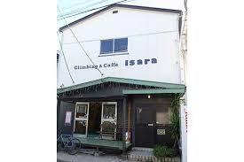
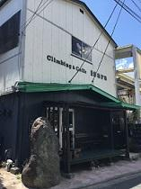
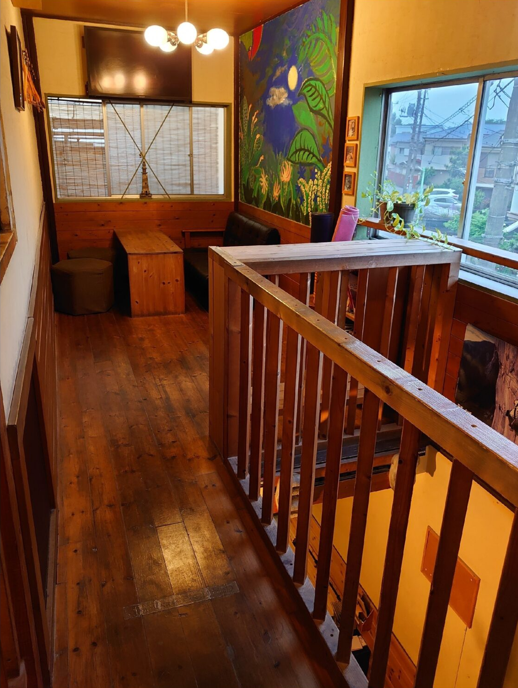
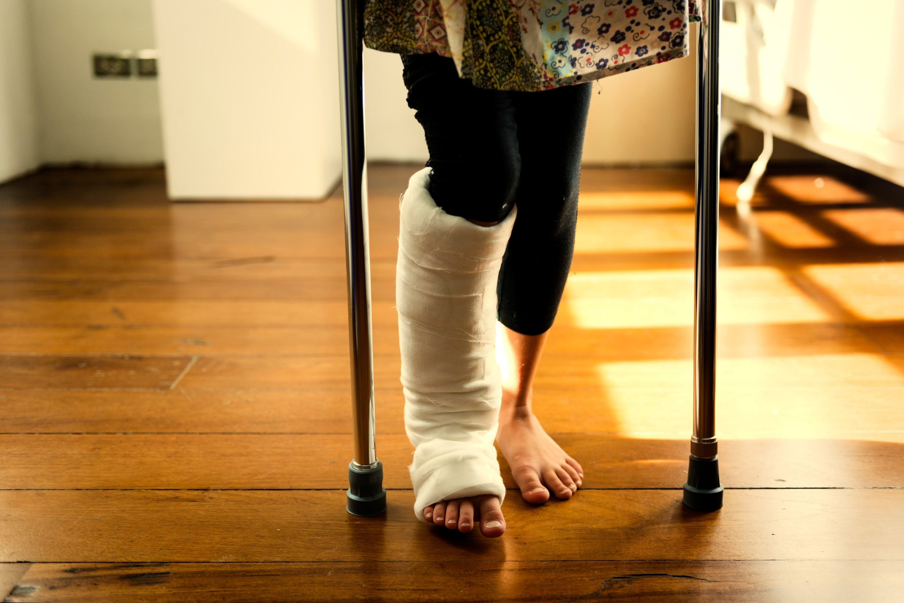

# 初めてクライミングジムに行く

大学4年の秋。
当時付き合っていた恋人に誘われて、休日に「ボルダリング」というものをやりに行くことになった。
交際を始めてまだ数ヶ月で、ふたりで遊びに行く場所を互いに積極的に提案し合っていた頃だ。

ボルダリングやフリークライミングが何なのか、そのときの自分はまだ何も知らなかった。

彼女が事前に場所を調べてくれていて、自分は何も知らないまま、三鷹駅から徒歩30分のジムにたどり着いた。
過ごしやすい秋だったので、駅からの道のりはむしろ心地よかった記憶がある。
あとから知ったことだが、当時でも、もっとアクセスのいいクライミングジムはいくつもあった。誰に勧められたわけでもないのに、どうしてこのジムにたどり着いたのか今でも不思議だが、最初に訪れたのがこのIsaraであってよかったと、今は思う。

Isaraの外観はこんな感じだ。

プレハブ小屋のような佇まいだが、バルコニーがあったり、本物の1.5mほどのボルダーが置かれていたりして、味のある雰囲気がある。

入口を抜けるとすぐクライミングエリアで、受付や更衣室は2階にある。迎えてくれたのは、いかにもクライミングをやりそうには見えない小柄な女性で、丁寧に受付をしてくれた。カウンターでコーヒーも注文できるようだったが、頼んでいる人をほとんど見たことがない。

> 自分はこのあと、しばらくIsaraに通うことになる。
> 通ううちに気づいたが、ここにスタッフがいるのは特定の曜日だけで、週の半分以上は誰も管理していない。入口に貼ってある電話番号にかけると、暗証番号を教えてくれて、それで中に入るという仕組みだった。
> 
> 鍵にどれほどの意味があるのかは今でもよくわからないが、このジムは常連たちの手で日々の運営が支えられているようだった。

着替えを済ませ、レンタルシューズに履き替えると、先ほどの女性が準備体操とルール、安全の注意点を丁寧に教えてくれた。見本として登ってくれたとき、その動きが妙に洗練されていて、思わず見入ってしまったのを覚えている。

> この人が[れな](/climbers/people/rena/)さんといって、ジムのオーナーだと知ったのは、しばらく経ってからだ。見た目は30代くらいで、こんなに若い女性がクライミングジムを経営しているのが意外だった。
> 
> 常連から聞いた話によると、Isaraはもともと、れなさんの亡くなった旦那さんが自分で立ち上げたジムだという。内装も、仲間たちと一緒に手作りしたそうだ。クライミングウォールの作り方は、今でこそ情報がいくらでも見つかるが、当時はかなり手探りだったのではないかと想像する。壁の裏を覗いてみると、試行錯誤の跡がたしかに残っていた。
> 
> 常連の中には、その旦那さんと顔見知りだった人もいるようだった。自分はあまり詳しいことを知らないし、れなさん本人から直接聞いたこともない。それでもこの残されたジムは、れなさんを含め、生前の旦那さんを知る人たちにとって、何か特別な場所なのかもしれない、と想像した。

このジムに来るまではあまり関心がなかったが、いざ中に入ってみると、すぐにのめり込めた。もともと体を動かすのが好きで、「この競技、自分得意そう」と思いながら試してみると、予想は一定当たっていた。とはいえ、そう甘くもない。
ボルダリングを初めてやった人なら誰しも経験することだが、普段使わない前腕の筋肉が酷使されて、30分も登れば手にまったく力が入らなくなる。翌日の筋肉痛もひどい。タイピングやペンを持つこともままならず、仕事にならない人も多い。

もう全く力が入らないのに、それでも登ってみたくて、れなさんが見せてくれたみたいに動きを工夫すれば登れるんじゃないかと、夢中で何度もトライしていた。

一緒に来た彼女はとっくに疲れていて、ベンチに座ってこちらを眺めていた。
暇そうにしている彼女に気づいたのか、れなさんが話を振っていた。

> 「今日は彼氏さんに連れてこられたんですか？」
>
> 「いや、実は私の方が誘ったんです」
>
> 「そうなんだ。てっきり連れてこられたのかと思いました。向こうのほうがハマっちゃってるね」

このやりとりが、なぜか妙に印象に残っている。

この日を境に、自分はすっかりクライミングにのめり込んだ。彼女との予定よりクライミングを優先することも度々あったが、もともと彼女が誘ってくれたアクティビティなのだから、と勝手に免罪符にして、罪悪感もなくラッキーだと思っていた。

2時間くらい楽しんだのち、その日は帰路に着いた。

---

### 2週間後、2回目のIsara

前回のボルダリングが楽しかったので、2週間後、再び二人でIsaraに行くことにした。

入口を入ると、この日もれなさんがいたのだが、座っているベンチの横には松葉杖が置いてあった。

「その足どうしたんですか？」と聞くと、仕事中に転んで骨折したとのことだった。

松葉杖を使いながら器用に2階の受付に案内してくれたことにまず驚いたのだが、その後しばらくして、骨折した足で課題を登りだした。危ないからやめたほうがいいと思いつつ、この人にとってこれが日常なのかもと思うと僕らは何も言わなかった。

> クライミングジムのスタッフは、お客さんとコミュニケーションを取る意味でも空いている時間は自分たちで登ったりする。また、新しい課題を作る作業をしていることもあるので、スタッフが壁を登ることは特によく見る光景である。

怪我をしても登りたいくらい楽しい行為なのかもしれないということ、
クライミングをする人たちは怪我について鈍感なのかもしれないということ、

クライミングと怪我について考えさせられた初めての経験がこの日だった。
