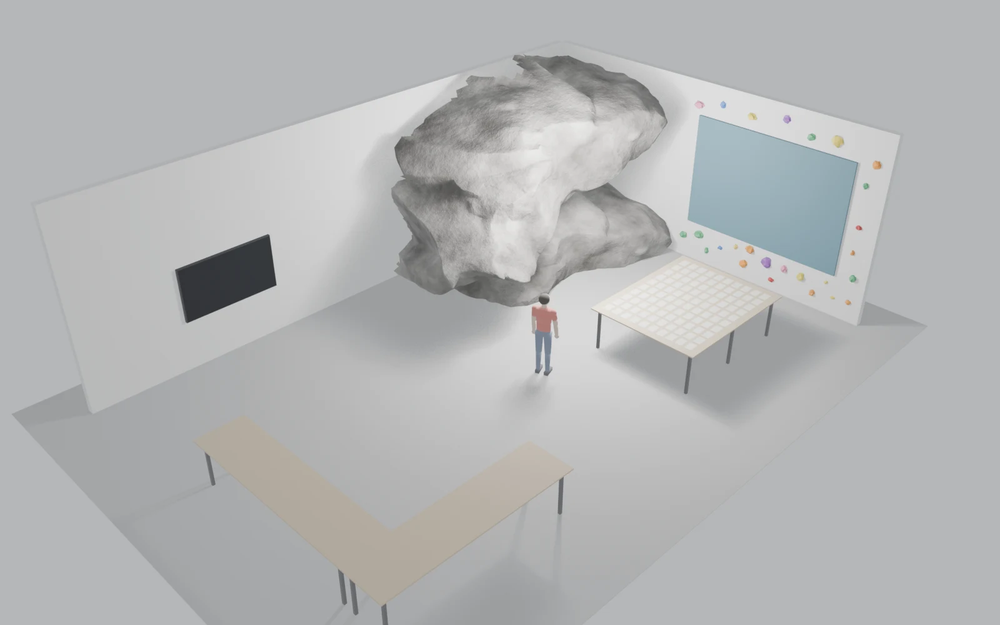
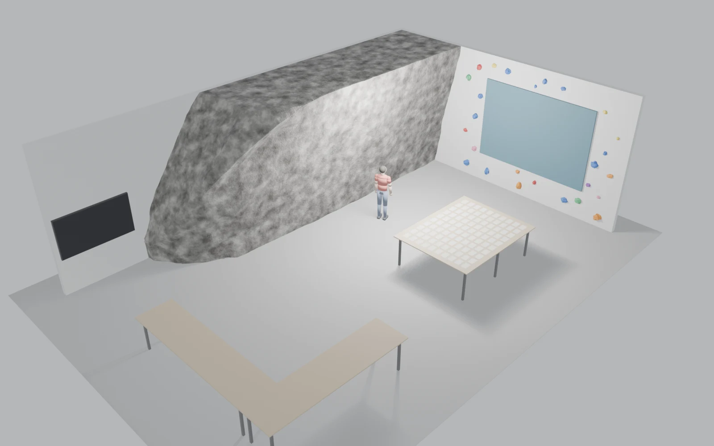
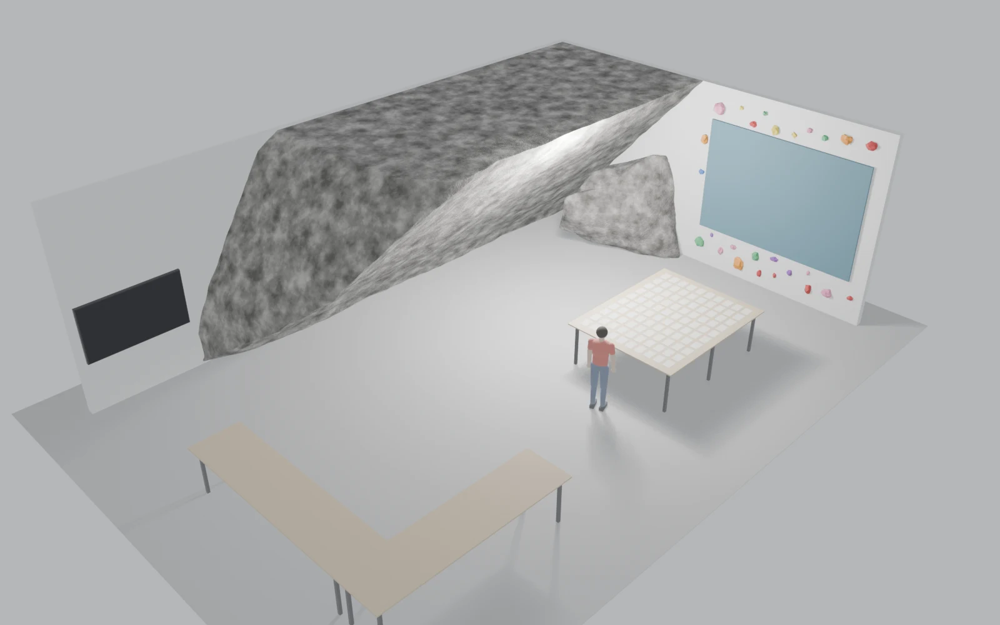
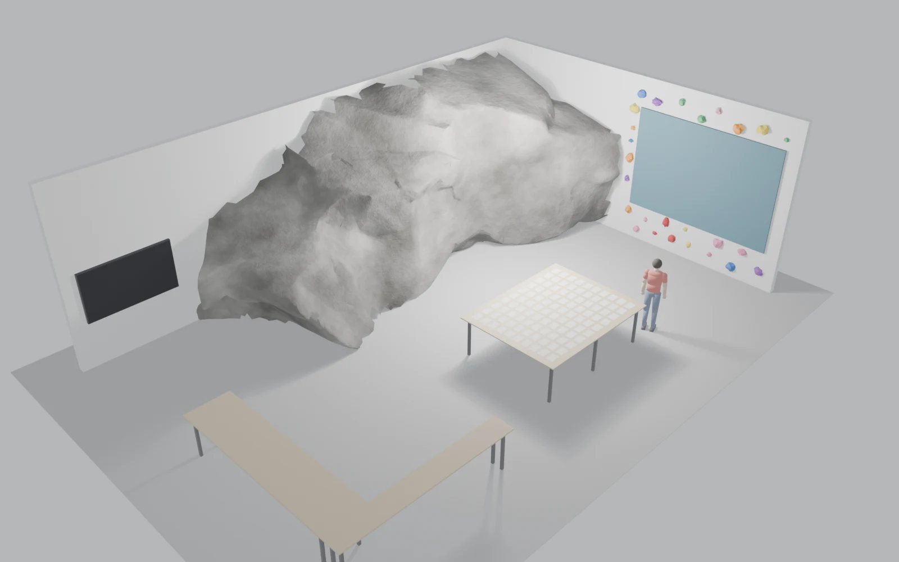
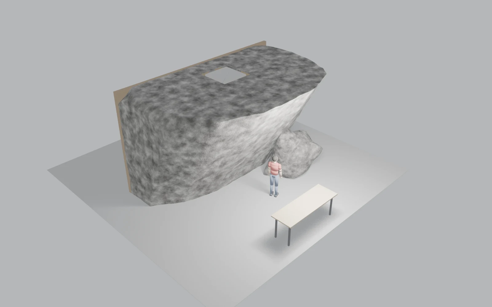
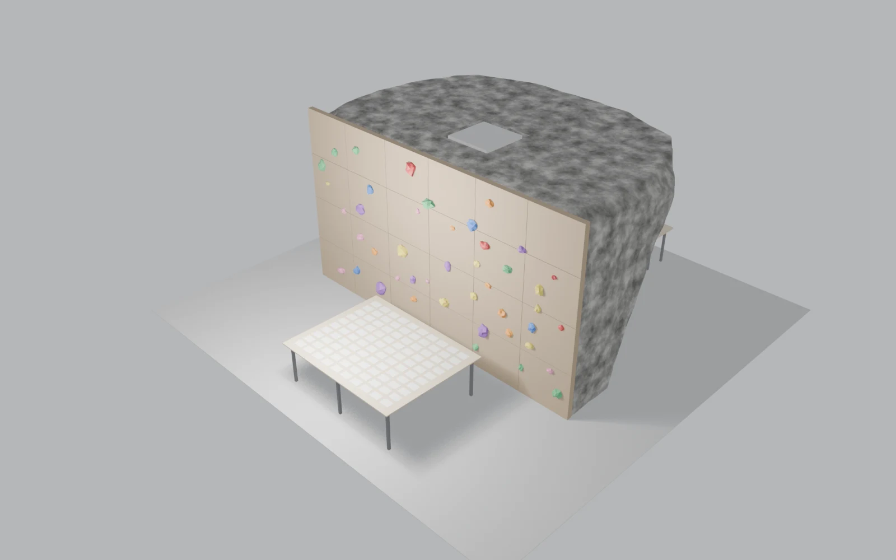

# 展示空間

卒業制作の展示空間を Blender で組み立てる。リサーチで集めたもの——写真、線画、インタビュー、用語——を、どの順序で、どの距離から見せるか。実際の会場に入る前に、立体で確かめる。

## 会場の条件

会場はゼロスペース。床から天井まで通った **1m × 1m の太い柱**がある。避けるか、囲い込むか、
どちらにせよ配置を決める前提になる。

（広さ、天井高、壁面、電源、搬入経路）

## 構成

岩のかたちは案ごとに変えているが、床に置くものはどれも同じにしてある。以下の画像に立っている人は身長170cmで、大きさを測る目安に置いた。

冊子を並べるテーブルは 2.90 × 2.30m、高さ0.90m。A5判の冊子を10列10行、ちょうど100冊並べられる寸法から決めた。まわりに15cmの余白をとり、冊子と冊子のあいだは約5.6cmあける。天板は合板で、脚はスチールにした。長辺が2.9mあるので、脚は四隅と長辺の中央をあわせて6本立てている。

長机は2台をL字に組んで、部屋の手前の左隅に置いた。冊子ではないもの——道具や写真——を置く台として使う。A・B・Cは2台とも 3.64 × 0.91m なので、片方を90度回して突き合わせればそのまま揃う。Dだけは手前の1台が奥行き0.455mと細いため、外側の辺をそろえて組んだ。内側の入隅には奥行きの差だけ段差が出る。

右側の壁にはダイアグラムを刷ったパネルを掛け、そのまわりにクライミングジムのホールドを26個散らした。ホールドは壁面から12〜16cm出る大きさで、パネルの縁からは13cm空けてある。

正面の壁には85型のディスプレイを1台ずつ掛けた。画面はベゼル込みで 1.91 × 1.09m、中心を床から1.55mの高さに置いている。A以外は岩が正面の壁をふさいでいるので、岩の脇に残った隙間に入れた。空いている幅はBが2.12m、Cが2.16m、Dが2.51mで、どこも85型がぎりぎり収まる。左右に残る余白はBで10cm、Cで12cm、Dで30cm。

## 岩の案

かぶりの角度と、壁と一続きにするかどうかを変えて5つつくった。A〜Dは 12 × 8m で、奥と右の2面が壁になっている。Eだけ 10 × 10m で、岩が中央に独立して立ち、1m角の柱を内側に抱えている。

A. 炎 / ロッキーボルダー

B. 薄かぶりの絶壁（壁と一続き）

C. どっかぶり（垂直から約42度・壁と一続き）

D. 忍者返しの岩

Eは岩が中央に独立して立つので、表と裏で見え方がまるで違う。表は被りのついた岩のままだが、裏は平らな垂直面なので、岩肌ではなく人工壁を張ることにした。合板のパネルを 7.08 × 4.0m の面いっぱいに6列4段で張り、継ぎ目を1cm空けている。ホールドは45個。両側から見たところを並べる。

E. 表：被り31度 / 裏：人工壁（柱 1×1m を内包）。左が表、右が裏。冊子のテーブルは裏に置いた。岩の上面に見える四角は、内側に抱えた1m角の柱の頭。

Eは部屋が 10 × 10m と狭いうえ、岩が中央を占める。冊子のテーブルを置けるのは岩の裏の帯だけで、前後の通路が0.61mずつしか残らない。他の4案は 12 × 8m あるので、同じテーブルを置いても1.6m以上の通路がとれる。
