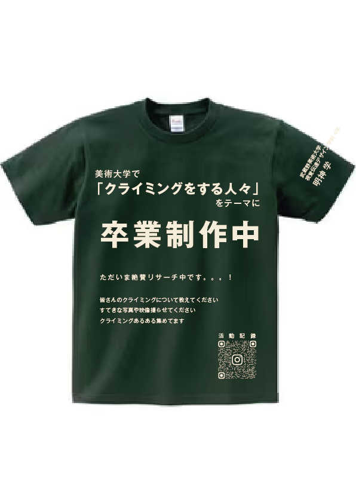
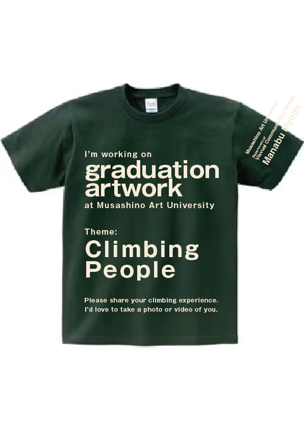

# Tシャツ

ジムや外岩で初対面の人に声をかけるのは難しい。こちらから話しかけなくても何をしている人か伝わるように、「美術大学でクライミングをテーマに卒業制作をしている」と書いたTシャツを作って着ている。

濃緑のボディに生成りのプリント。前面には卒業制作中であることと、写真や映像を撮らせてほしい・話を聞かせてほしいという依頼を入れた。袖には大学名・学科名と名前を縦に入れている。

## 日本語版

国内のジムや岩場で着るための版。前面下部のQRコードから活動記録に飛べるようにしてある。

## 英語版

海外から来ているクライマーに向けた版。日本語版と同じ内容を英語で組み直した。
