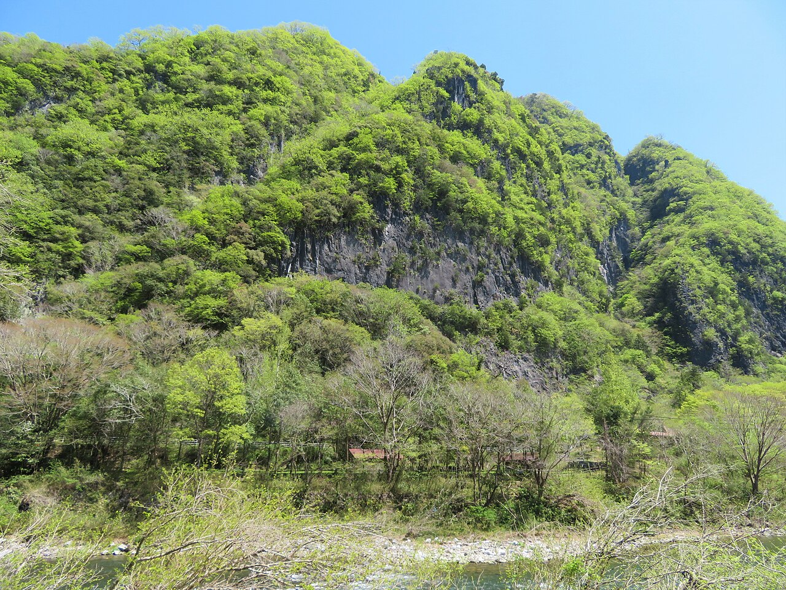

# 備中

岡山県高梁市の備中町・川上町・成羽町などに、石灰岩の壁が点在する。ルートは300本以上。じゃろう岩、2ルンゼ、奥の院、川エリア、権現谷、勝山、ニューエリア、羽山といったエリアに分かれる。

岡山自動車道の賀陽インターから30分、中国自動車道の北房インターから40分。JR伯備線の高梁駅からバスで30分、用瀬橋で降りて徒歩3分。

集落のすぐそばに岩場があるため、住民との関係に気を配ることが求められている。

高梁市備中町の用瀬嶽。川沿いに石灰岩の壁が続く — Jogungagon（2022年） / <a href="https://commons.wikimedia.org/wiki/File:Yozedake_free_climbing_area202204-01.jpg">Wikimedia Commons</a> / <a href="https://creativecommons.org/licenses/by-sa/4.0">CC BY-SA 4.0</a>

