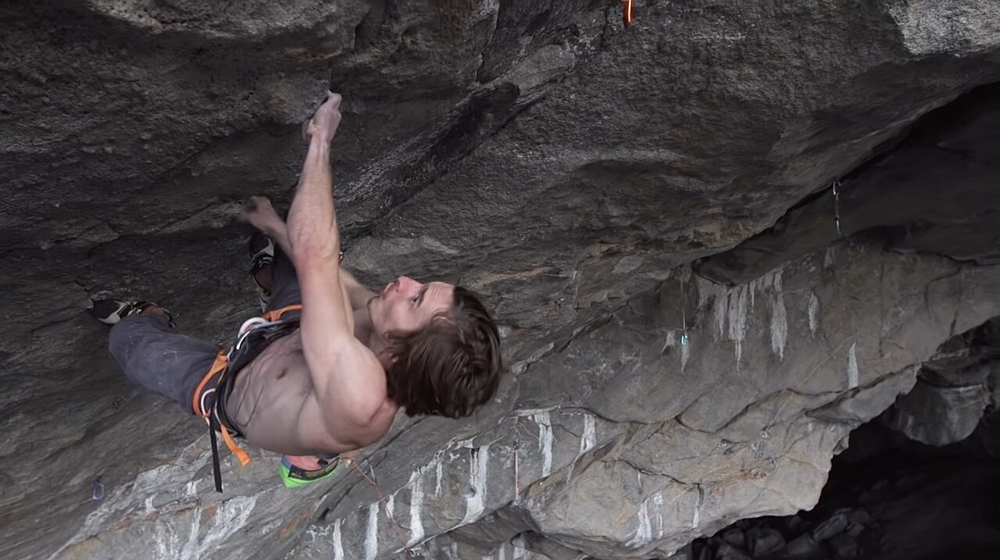
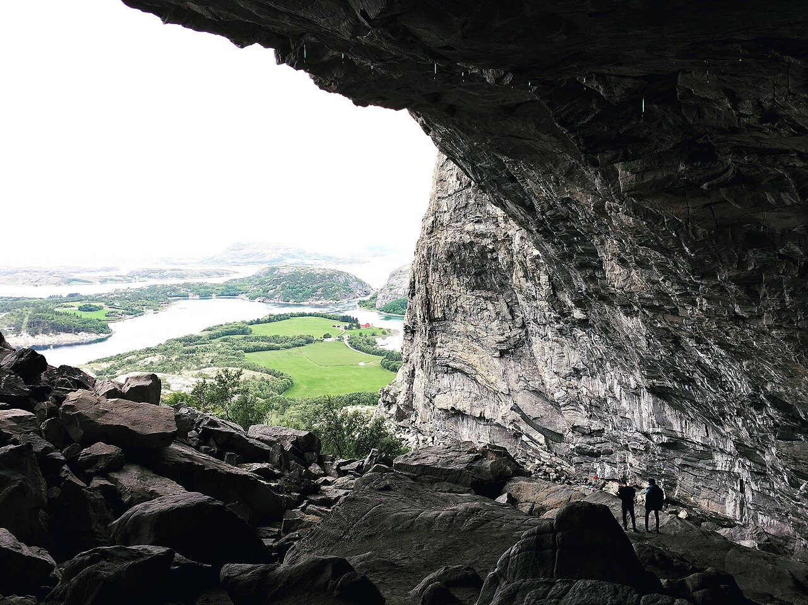

# フラタンゲル

ノルウェー中部の海沿いにある町。ハンスヘレン（Hanshelleren）と呼ばれる巨大な洞窟状の岩壁があり、天井から大きく被った壁に現在の世界最難のルートが集まっている。

2012年、アダム・オンドラが「Change」（9b+）を初登。2017年9月3日には同じ壁の45mのルート「Silence」を登り、世界で初めて 9c が提案された。

→ [アダム・オンドラ](/climbers/famous/adam-ondra/) / [グレード](/basics/grades/)

出典: [Silence（英語版ウィキペディア）](https://en.wikipedia.org/wiki/Silence_(climb))

ハンスヘレンの被った壁を登るダニエル・ウッズ（2015年） — Petzl Sport / <a href="https://commons.wikimedia.org/wiki/File:Daniel_Woods_Hanshelleren_01.jpg">Wikimedia Commons</a> / <a href="https://creativecommons.org/licenses/by/3.0">CC BY 3.0</a>

ハンスヘレンの洞窟から見たフラタンゲルの入り江 — Mountain Master（2018年） / <a href="https://commons.wikimedia.org/wiki/File:Hanshelleren_view.jpg">Wikimedia Commons</a> / <a href="https://creativecommons.org/licenses/by-sa/4.0">CC BY-SA 4.0</a>

