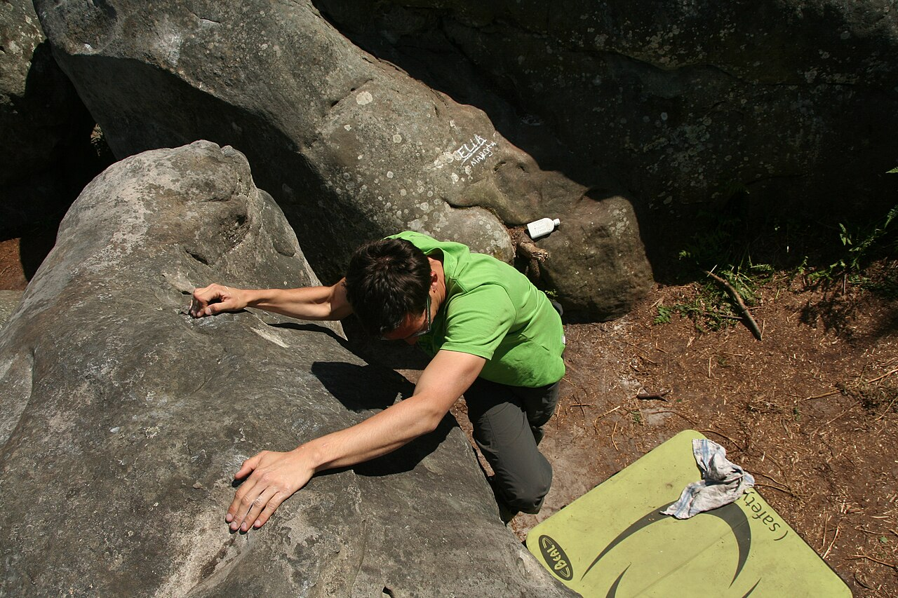

# フォンテーヌブロー

パリの南東約60km、250km²ほどの森に砂岩の岩が散らばっている。課題は2万から3万以上あるとされ、世界最大のボルダーエリアになっている。下地が砂で柔らかいことも、この森の特徴として挙げられる。

19世紀末からフランスのアルピニストが訓練場として使ってきた。1940年代にフレッド・ベルニックが岩に色の点と矢印を描き、20〜50課題を続けて登る「サーキット」を作った。色ごとに難度がまとまっていて、いまも同じ方式が使われている。ボルダーのグレードとして広く使われる Font グレード（7A、8A といった表記）はこの土地の名前から来ている。

下にマットを敷き、もう1人がスポットに付くという現在のボルダリングの形も、この森で固まった。

→ [クライミングの歴史](/basics/history/) / [グレード](/basics/grades/)

出典: [Fontainebleau rock climbing（英語版ウィキペディア）](https://en.wikipedia.org/wiki/Fontainebleau_rock_climbing)、[The Visionary Appeal of Fontainebleau's Bouldering Circuits（Climbing）](https://www.climbing.com/travel/fontainebleaus-bouldering-circuits/)

フォンテーヌブローの砂岩。下にマットを敷いて登る — Jerome Bon（2014年） / <a href="https://commons.wikimedia.org/wiki/File:Escalade_%C3%A0_Fontainebleau_(14255556941).jpg">Wikimedia Commons</a> / <a href="https://creativecommons.org/licenses/by/2.0">CC BY 2.0</a>

