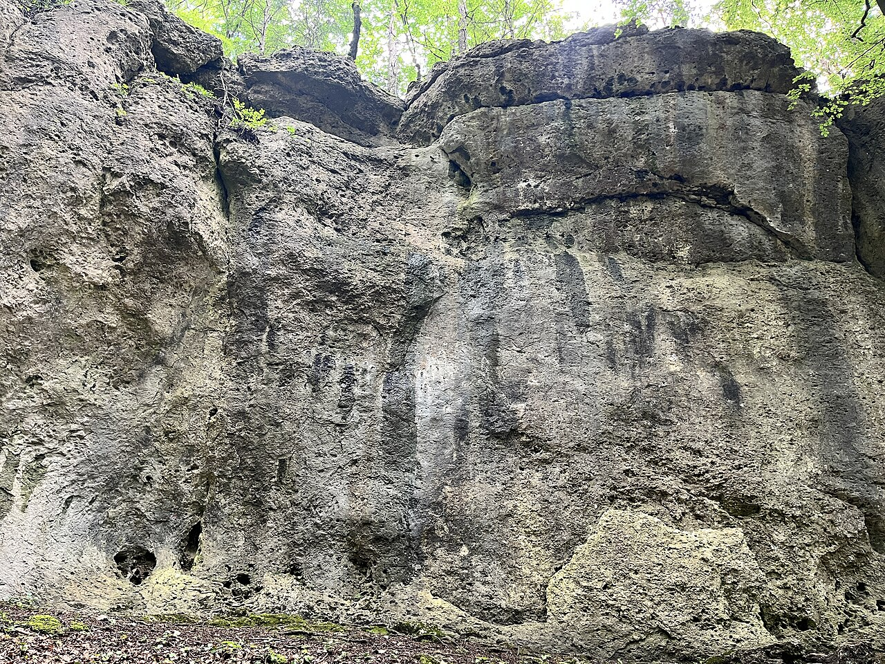

# フランケンユーラ

ドイツ・バイエルン州北部に広がる石灰岩地帯。1000以上の小さな岩場に、ガイドブックに載っているだけで7000本、全体では14000本を超えるルートがあるとされる。指1〜2本が入るポケットが多く、1本が短いぶん強度の高い登りになる。

1991年、ヴォルフガング・ギュリッヒがヴァルトコップフの15mのルート「Action Directe」を初登した。これが世界で初めて 9a と認められたルートになる。ギュリッヒはこのルートのために、桟を指で持って足を使わずに登り降りするキャンパスボードを考案した。

→ [ヴォルフガング・ギュリッヒ](/climbers/famous/wolfgang-gullich/) / [クライミングの歴史](/basics/history/)

出典: [Action Directe（英語版ウィキペディア）](https://en.wikipedia.org/wiki/Action_Directe_(climb))、[DESTINATION GUIDE: Frankenjura（UKC）](https://www.ukclimbing.com/articles/destinations/frankenjura_-_limestone_in_the_limelight-2742)

フランケンユーラの岩。穴だらけの石灰岩が指を入れるホールドになる — Jvaclavik（2024年） / <a href="https://commons.wikimedia.org/wiki/File:Frankenjura_-_Hartenfels2.jpg">Wikimedia Commons</a> / CC0

