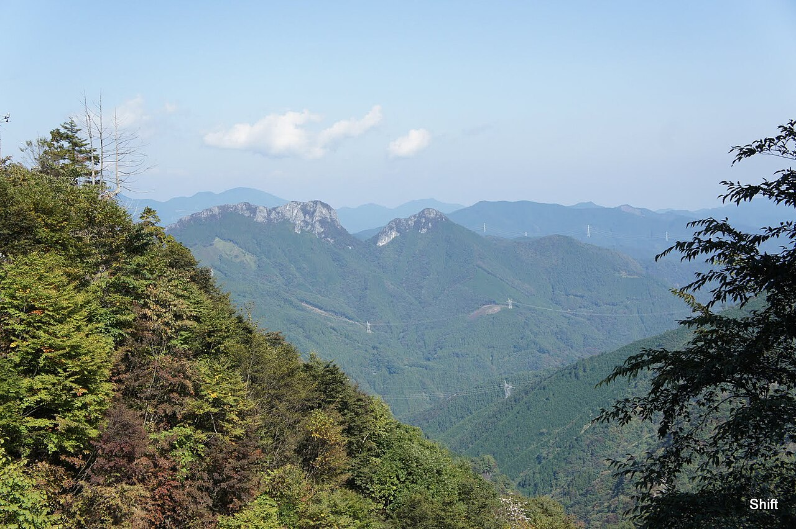

# 二子山

埼玉県秩父郡小鹿野町。西岳と東岳が並ぶ双耳峰で、山そのものが石灰岩でできている。石灰岩からはフズリナやウミユリの化石が出る。約3.2億年前から2.5億年前、古生代の石炭紀からペルム紀にできた岩だとされる。

ルートは160本。内訳は5.9以下が8本、5.10台が29本、5.11台が86本、5.12台が44本、5.13台が13本、5.14台が2本で、11台から上に厚みがある。壁の傾斜は90度から135度で、被った壁を登る岩場になる。

2000年代以降、平山ユージが再生と開拓を進めてきた。弓状エリアの「フラットマウンテン」（5.14d/15a）は当時の国内最難ルートで、平山が初登している。2022年3月6日には西岳の祠エリアで1年がかりのプロジェクトを完登し、「Peaceful Mountain」9a（5.14d）とした。

通年登れるが、梅雨と夏は壁の染み出しで登れない。国道299号から坂本経由で入るのが一般的。

二子山を南南西から見る。石灰岩の双耳峰が林の上に出ている — Shift（2011年） / <a href="https://commons.wikimedia.org/wiki/File:Mount_Futago_(Ogano)_2011-10-10.jpg">Wikimedia Commons</a> / <a href="https://creativecommons.org/licenses/by-sa/3.0">CC BY-SA 3.0</a>

