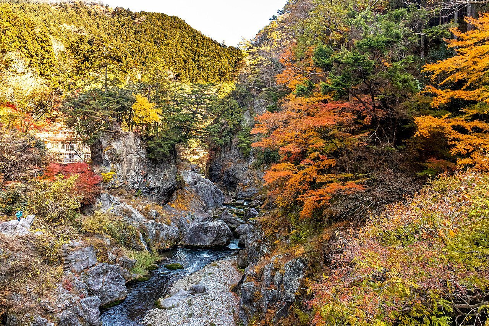

# 鳩ノ巣

東京都奥多摩町、多摩川の鳩ノ巣渓谷にある。JR青梅線の鳩ノ巣駅からすぐで、御岳より谷が深く、岩は渓谷の底に散らばっている。岩質はチャートで、課題は100以上ある。

上流の白丸ダムの放流で水位が上下するため、川際の岩は水没することがあり、登れるのは10月から3月が中心になる。

神社やハイキング道のすぐ脇に岩がある場所も多く、観光客と至近距離になる。駐車と利用のルールは奥多摩クライミング委員会が定めていて、新規開拓は原則として禁止されている。

鳩ノ巣渓谷。谷底の岩が課題になっている — くろふね（2025年） / <a href="https://commons.wikimedia.org/wiki/File:%E9%B3%A9%E3%83%8E%E5%B7%A3%E6%B8%93%E8%B0%B7%EF%BC%88%E6%9D%B1%E4%BA%AC%E9%83%BD%E5%A5%A5%E5%A4%9A%E6%91%A9%E7%94%BA%EF%BC%8920251129-IMG_5400.jpg">Wikimedia Commons</a> / <a href="https://creativecommons.org/licenses/by/4.0">CC BY 4.0</a>

