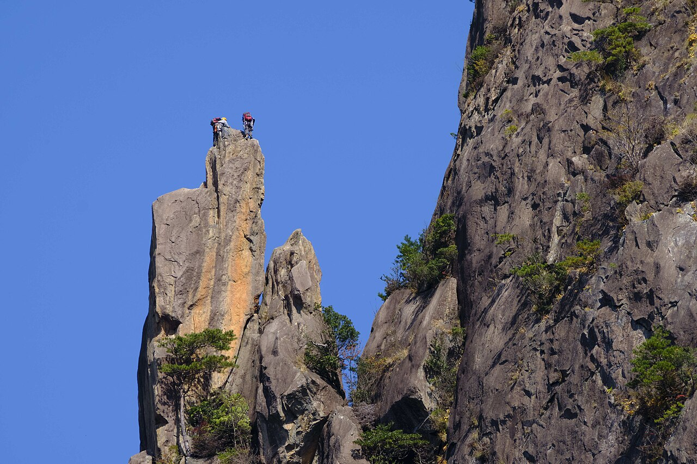

# 比叡

宮崎県延岡市。花崗岩の岩峰が3つ並び、50本以上のマルチピッチのルートがある。スラブ、クラック、カンテと登り方の幅が広い。北部九州の大崩山系の一角で、矢筈岳や行縢と合わせて大きなエリアを作っている。

同じ規模の壁を登ろうとすると穂高や剱に行くことになるが、比叡は駐車場から歩いてすぐ取り付ける。シーズンは4月から11月。

延岡から国道218号で槙峰を経由し、県道214号を上鹿川方面へ。綱の瀬川沿いを走ると、菅原の集落から比叡山が見えてくる。

宮崎県延岡市の比叡山。花崗岩の岩峰が並ぶ — Shiro_KUROGI（2022年） / <a href="https://commons.wikimedia.org/wiki/File:Miyazaki-Mt.Hiei(in_Miyazaki)-xl.jpg">Wikimedia Commons</a> / <a href="https://creativecommons.org/licenses/by/4.0">CC BY 4.0</a>

