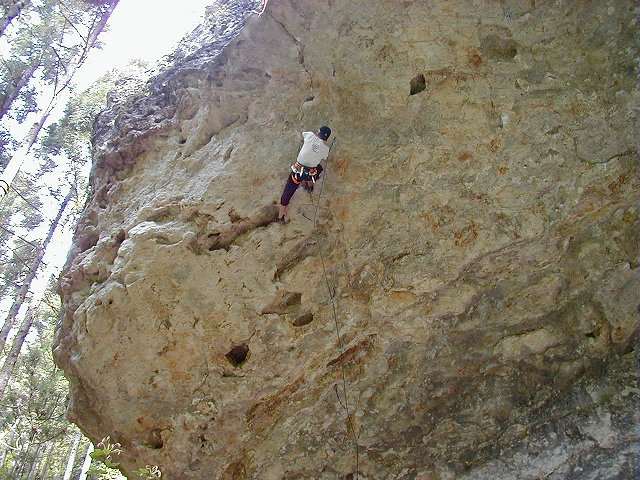

# 鳳来

愛知県新城市、旧鳳来町のあたり。岩質は凝灰岩で、指が入る穴（ポケット）が壁一面に開いている。ルートは禁止エリアを含めて約200本。ガンコ岩、烏帽子岩、鬼岩、ハイカラ岩などのエリアがある。

浜松西インターから1時間、豊川インターから50分。JR飯田線の三河川合駅から歩いて20分。

ホールドの掃除はナイロンのブラシ以外を使わないこと、駐車のマナーを守ること、焚き火をしないこと、携帯トイレを持参することが求められている。影の大物と小屋裏のエリアは立入禁止。

鬼岩・ハイカラ岩。穴の開いた凝灰岩を登る — BeckyYoshikawa（2003年） / <a href="https://commons.wikimedia.org/wiki/File:Oniiwa01.jpg">Wikimedia Commons</a> / <a href="https://creativecommons.org/licenses/by-sa/3.0">CC BY-SA 3.0</a>

