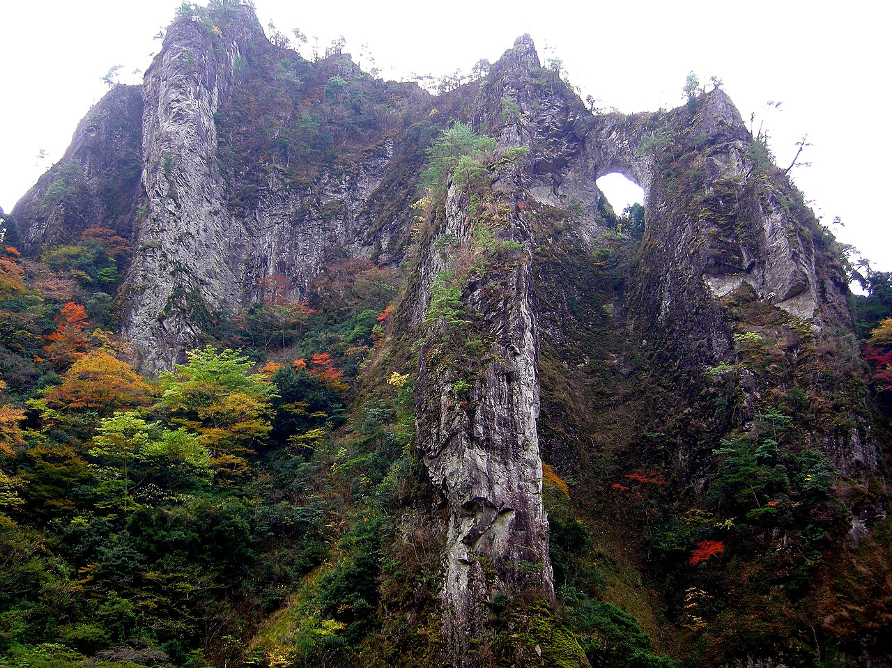

# 日向神

福岡県八女市の旧黒木町・矢部村にまたがる日向神峡。傾斜90度の大きな一枚岩が、谷を挟んで向かい合うように連なっている。岩質は安山岩で、ルートは95本以上。

かつては人工登攀を主体にしたロングルートが中心だったが、いまは1ピッチのフリークライミングが主流になっている。壁の規模は残ったまま、登り方だけが入れ替わった岩場と言える。

九州自動車道の八女インターから車で約1時間。国道442号を日向神ダムに向かう。

日向神峡。谷の両側に安山岩の壁が立つ — Yuji Sakamoto / <a href="https://commons.wikimedia.org/wiki/File:%E6%97%A5%E5%90%91%E7%A5%9E%E5%B3%A1%E3%81%AE%E6%99%AF%E8%A6%B3_Landscape_Hyugamikyo_-_panoramio.jpg">Wikimedia Commons</a> / <a href="https://creativecommons.org/licenses/by-sa/3.0">CC BY-SA 3.0</a>

