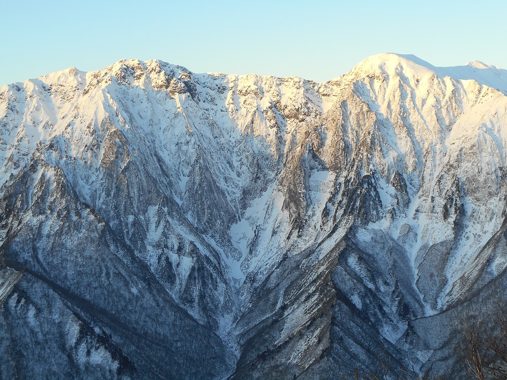

# 一ノ倉沢

群馬県みなかみ町、谷川岳の東面にある大岩壁。沢の下部は石英閃緑岩、中間は輝緑岩、稜線に近い上部は蛇紋岩でできていて、高さによって岩が変わる。蛇紋岩は濡れるとよく滑る。

1931年に上越線が全通して、谷川岳は首都圏から夜行列車で日帰りできる山になった。剱岳や穂高岳に劣らない急峻な壁が大学山岳部や社会人登山家に好まれ、戦争による中断を挟んで、1960年代までクライマーを中心とした登山ブームが続いた。

遭難の統計は1931年から取られていて、2012年までの死者は805名にのぼる。1959年に最後の課題とされた衝立岩正面壁が南博人と藤芳泰によって初登攀され、初登攀を争う時代が終わった。

1980年、戸田直樹と加藤泰平がコップ状岩壁正面壁の雲表ルートをフリー化する。道具を使って登る壁を手と足だけで登り直したこの登攀は、各地で起きていたフリークライミングの動きを大きなうねりに変えた。

→ [クライミングの歴史](/basics/history/)

雪をまとった一ノ倉沢の岩壁 — Kumpei Shiraishi / <a href="https://commons.wikimedia.org/wiki/File%3AIchinokura-sawa_%2825084338898%29.jpg">Wikimedia Commons</a> / <a href="https://creativecommons.org/licenses/by/2.0">CC BY 2.0</a>

