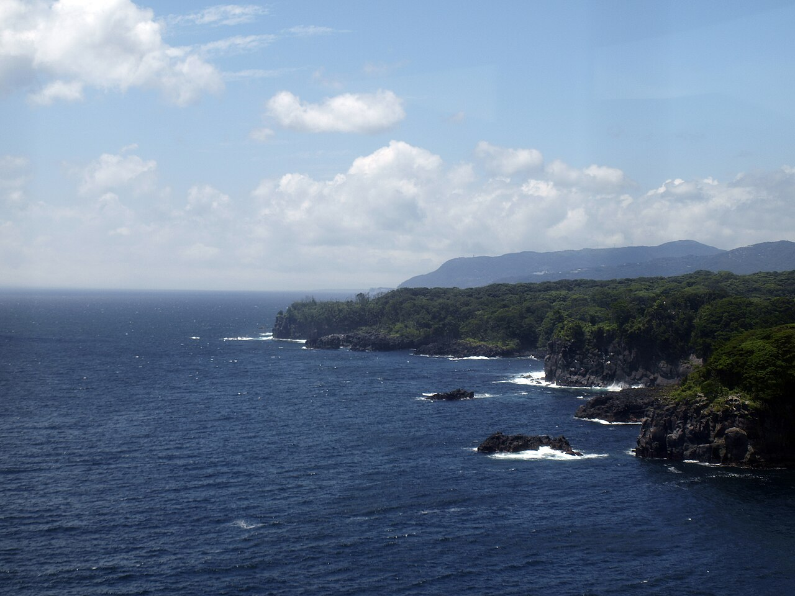

# 城ヶ崎

静岡県伊東市、伊豆半島の東海岸。大室山の噴火で流れ出た溶岩が海に接して固まった安山岩の岸壁で、縦に走る柱状節理がそのままクラックになっている。

ルートは約500本。シーサイド、ファミリー門脇南、浮山橋、大穴口（アストロドーム）、フナムシロックなどのエリアがあり、人気はシーサイド。開拓は1981年に始まり、最初からフリークライミングの岩場として扱われた。1987年にシーサイドカップが開かれ、その後フェースのルートが次々に開かれている。日本でフリークライミングが根づいていく時期の中心にあった岩場のひとつ。

伊豆急行の富戸・城ヶ崎海岸・伊豆高原の各駅から歩ける。

国立公園の中の私有地で、公認された岩場ではない。海に近いぶん残置された支点の傷みが激しく、シーサイド以外のボルトやピトンは信用できないとされる。初心者同士でシーサイドに行くことは勧められていない。

門脇崎灯台から見た城ヶ崎海岸。溶岩が海に落ちる縦の壁が続く — Tomo（2009年） / <a href="https://commons.wikimedia.org/wiki/File:J%C5%8Dgasaki_Coast_01.jpg">Wikimedia Commons</a> / <a href="https://creativecommons.org/licenses/by/2.0">CC BY 2.0</a>

