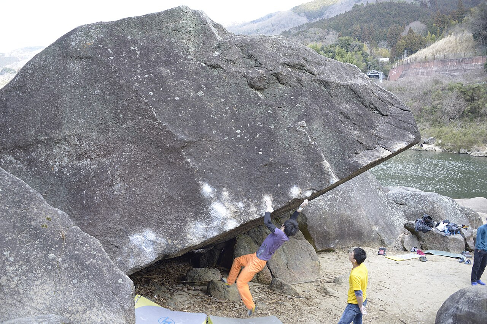

# 笠置

京都府相楽郡笠置町、木津川の川沿いに花崗岩の岩が並ぶ。関西を代表するボルダーエリアで、下流・中流・上流の3エリアに分かれる。課題は100〜120ほど。

1980年代から開かれた古いエリアで、ほとんどの課題は1990年の時点で登られている。背の高い岩が多いが、下地は悪くない。

JR関西本線の笠置駅から徒歩5分。電車で行ける数少ない岩場のひとつになっている。大阪からは国道163号で1本、京都からは国道24号を南下して163号に入る。

岩場の周辺での宿泊とキャンプはできない（河川敷の笠置キャンプ場は利用できる）。真冬は寒さが厳しいが、通年登れる。

木津川沿いの花崗岩。被った岩の縁を越える — Ujigis（2017年） / <a href="https://commons.wikimedia.org/wiki/File:%E7%AC%A0%E7%BD%AE%E7%94%BA%E3%83%9C%E3%83%AB%E3%83%80%E3%83%AA%E3%83%B3%E3%82%B0%E9%A2%A8%E6%99%AF.jpg">Wikimedia Commons</a> / <a href="https://creativecommons.org/licenses/by-sa/4.0">CC BY-SA 4.0</a>

