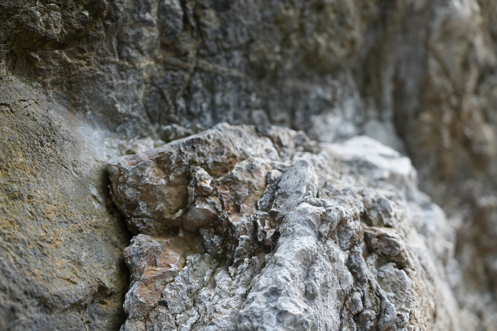
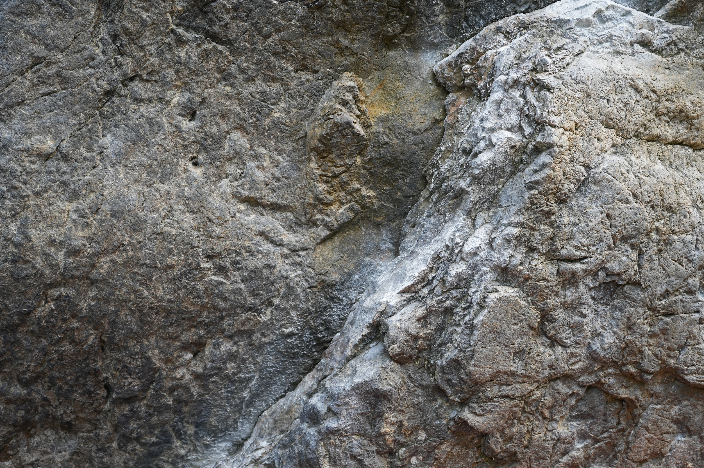

# 忍者返し

御岳を代表するボルダー課題のひとつ。国内では初段グレードの基準課題として広く認知されており、「忍者返しが登れたら初段」という言い方がよくされる。別名「クォークI」とも呼ばれる。

## 課題

| 課題名 | グレード | 備考 |
|---|---|---|
| 忍者返し | 初段 | 初段の基準課題 |
| （他の課題）| （要確認）| |

## 歴史

初登：（要確認）

御岳ボルダーの中でも特に知名度が高く、日本のボルダリング文化において象徴的な立ち位置にある。多くのクライマーが「初段の壁」として挑む課題で、達成の記念に写真を撮る人も多い。

## 解説動画

<iframe src="https://www.youtube.com/embed/EFTpobNI-ls" title="忍者返し 解説" allowfullscreen></iframe>

## チッピング問題

忍者返しはホールドの人工的な加工（チッピング）が行われた課題として知られており、クライミングコミュニティ内で議論を呼んできた。チッピングとは岩を削ってホールドを作ったり形を変えたりする行為で、外岩では本来禁忌とされる。忍者返しの場合は加工の時期や経緯が複雑で、「チッピングされた課題を登ることの是非」という倫理的な問いを提示してきた課題でもある。（詳細要確認）
