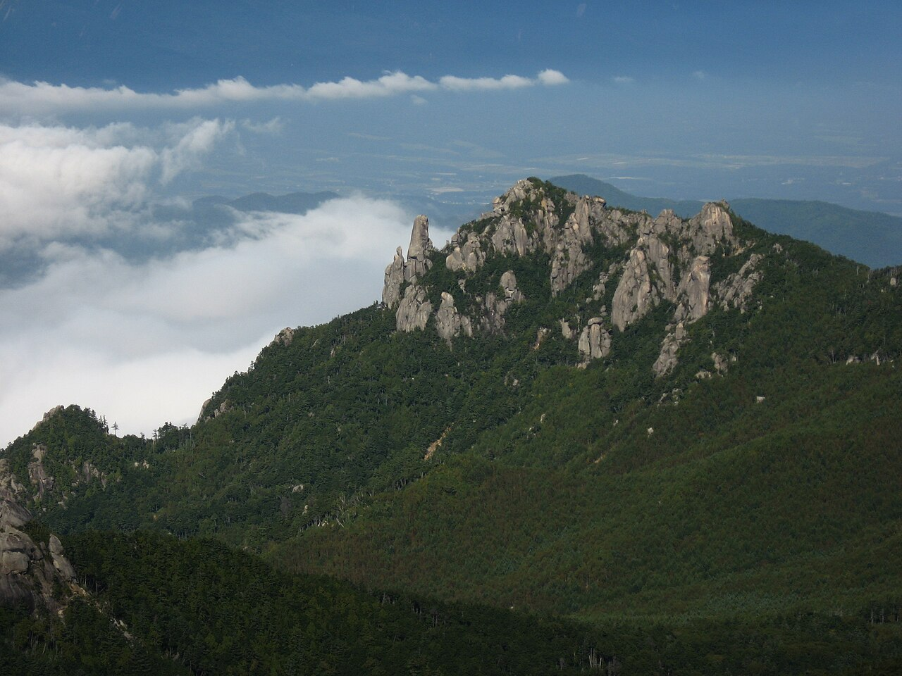
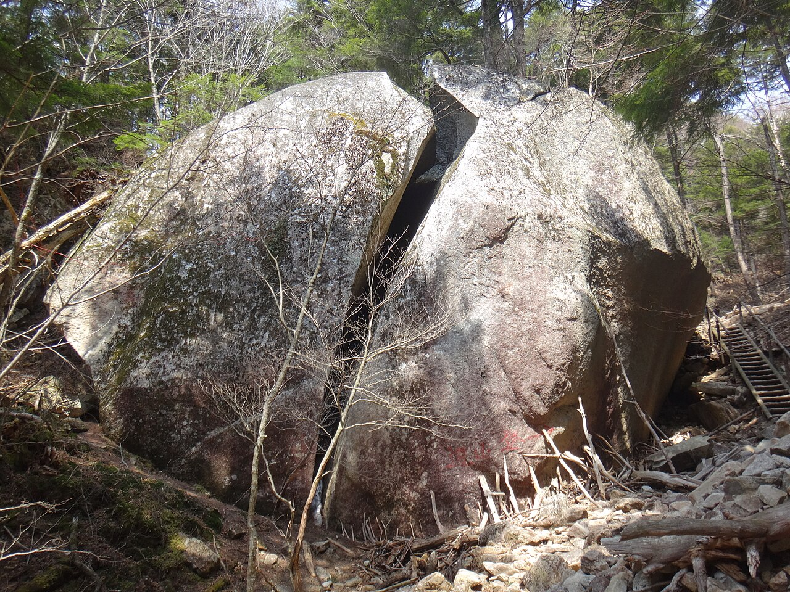

# 瑞牆

山梨県北杜市須玉町。山全体が花崗岩でできていて、十一面岩・大ヤスリ岩・カンマンボロン・大面岩・不動沢・カサメリ沢といったエリアに分かれる。

クラックを主体にした岩場で、ボルトを打ったスポートルートが集まるのはカサメリ沢だけになる。カサメリ沢は標高1600mほどあり、原生林に覆われていて真夏でも涼しい。

1970年に東京ハイピーク・クラブが大ヤスリ岩を初登し、1970〜80年代にフリー化が進んだ。1981年には戸田直樹が十一面岩末端壁の「春うらら」1ピッチ目をフリーで登り、5.11bが与えられている。近年はボルトを足さずに登るトラッド志向の開拓が見直されている。

秩父多摩甲斐国立公園の中にあるため環境を変える行為は禁止されている。12月上旬から4月中旬は駐車場が閉まり、キャンプは指定地のみ。

瑞牆山。中央に突き出た岩峰が大ヤスリ岩 — Σ64（2007年） / <a href="https://commons.wikimedia.org/wiki/File:Mt.Mizugaki_02.jpg">Wikimedia Commons</a> / <a href="http://creativecommons.org/licenses/by-sa/3.0/">CC BY-SA 3.0</a>

登山道の途中にある桃太郎岩。瑞牆の花崗岩の肌が近くで見える — Koda6029（2016年） / <a href="https://commons.wikimedia.org/wiki/File:%E6%A1%83%E5%A4%AA%E9%83%8E%E5%B2%A9.jpg">Wikimedia Commons</a> / <a href="https://creativecommons.org/licenses/by-sa/4.0">CC BY-SA 4.0</a>

