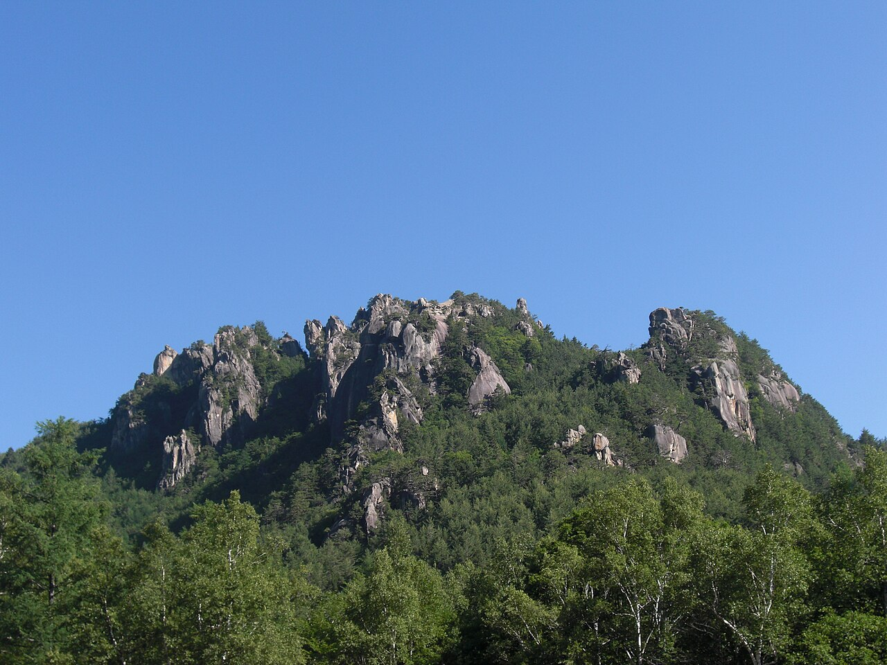
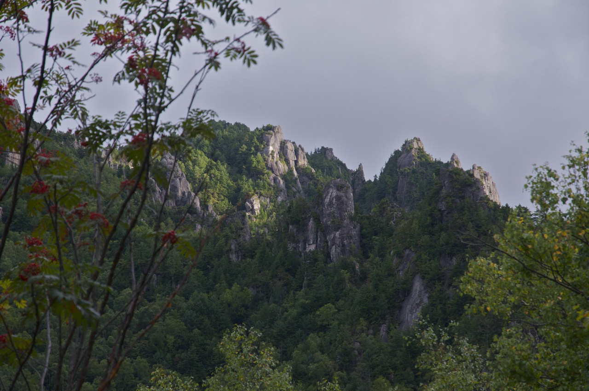

# 小川山

長野県南佐久郡川上村。金峰山の一部が丸ごとクライミングエリアになっていて、白い花崗岩の岩峰が林の上に突き出している。廻り目平キャンプ場が拠点で、ここは「日本のヨセミテ」と呼ばれる。

ルートは約700本あり、ボルトルート・クラック・マルチピッチ・ボルダーが同じ場所に揃っている。砦岩、屋根岩、おむすび山、水晶スラブなどのエリアがある。

クジラ岩の「エイハブ船長」（一級）は一級というグレードの基準とされる課題で、[御岳](/places/crag/mitake/)の忍者返し・デッドエンドと並ぶ古典に数えられる。初登は中山芳郎（1980年代前半）。すぐ左に「穴社長」（二段）、右に「緑のマント」（初段）がある。

須玉インターから約1時間半。キャンプ場は9時消灯が原則で、大雨のあとは林道が閉まることがある。

廻り目平キャンプ場から見た屋根岩 — Kumpei Shiraishi（2014年） / <a href="https://commons.wikimedia.org/wiki/File:Yaneiwa_Rock_in_Mount_Ogawa_from_Mawarime_Daira.JPG">Wikimedia Commons</a> / <a href="https://creativecommons.org/licenses/by/4.0">CC BY 4.0</a>

樹林の上に連なる花崗岩の岩峰 — Koichi Oda（2011年） / <a href="https://commons.wikimedia.org/wiki/File:Rock_formation_in_Mt._Ogawayama_-_Flickr_-_odako1.jpg">Wikimedia Commons</a> / <a href="https://creativecommons.org/licenses/by/2.0">CC BY 2.0</a>

