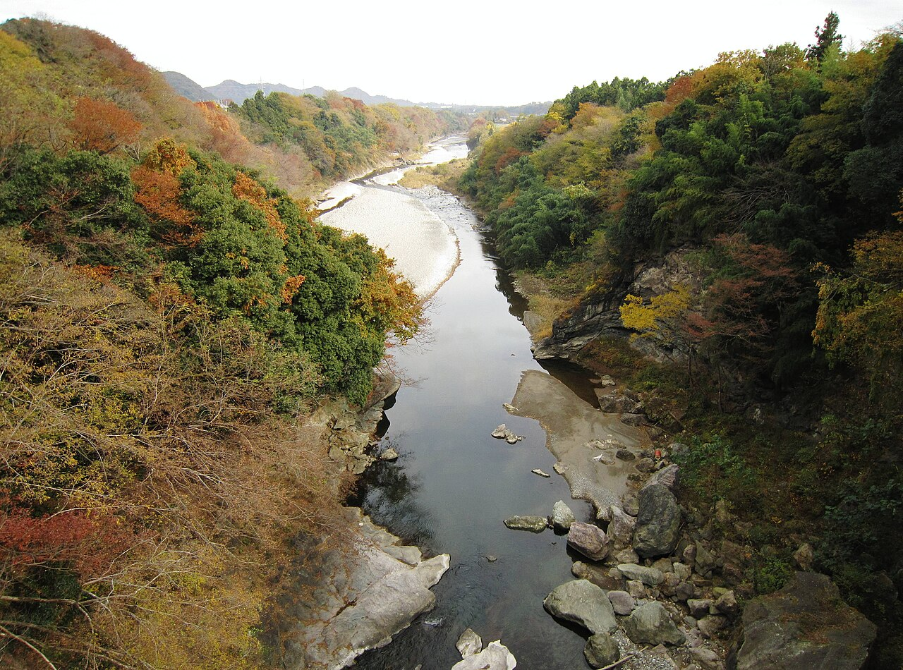

# 下仁田

群馬県甘楽郡下仁田町、鏑川の河原にある。岩質は流紋岩で、水に磨かれてつるりとしているが、フリクションはある程度効く。

狭い範囲に岩が密集しているので岩から岩への移動が楽で、平地で日当たりがよい。課題は40本ほどあり、ネギ（二級）、道化師（初段＋）、抜歯（二段）、日野ランジ、タッキートラバースなどが登られている。

上信電鉄の千平駅から徒歩20分。車なら路肩に3〜5台停められ、高速のインターと道の駅が近い。大雨のたびに下地が変わる。

下仁田町馬山の鏑川（不通渓谷）。岩場は同じ川の河原にある — Qurren（2012年） / <a href="https://commons.wikimedia.org/wiki/File:Kabura_River_from_Torazu_Bridge.jpg">Wikimedia Commons</a> / <a href="https://creativecommons.org/licenses/by-sa/3.0">CC BY-SA 3.0</a>

