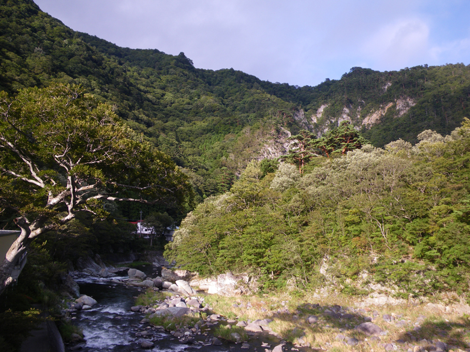

# 塩原

栃木県那須塩原市塩原、箒川の河原にある。国道400号沿いの無料駐車場から2〜3分で、野立岩を中心に200mほどの範囲に10個ほどの岩がまとまっている。

岩質は大谷石と呼ばれる凝灰岩で、かなりもろい。95課題のうち三段以上が23本、初段以上が47本を占めていて、高難度に偏った岩場になっている。駐車場から最も近い「桜」（三級）は、短いなかにカチとスローパーが詰まった好課題とされる。標高があるので夏でも登れる。

もろい岩質のため、ガスバーナーで乾かすこととワイヤー・真鍮のブラシは禁止されている。土嚢などで下地を変えることとナイトクライミングも禁止。釣り人が入る川でもある。

塩原温泉近くの箒川。岩場はこの河原にある — Kanohara（2009年） / <a href="https://commons.wikimedia.org/wiki/File:Hokigawa_river_and_Shiobara_valley_001.jpg">Wikimedia Commons</a> / パブリックドメイン

