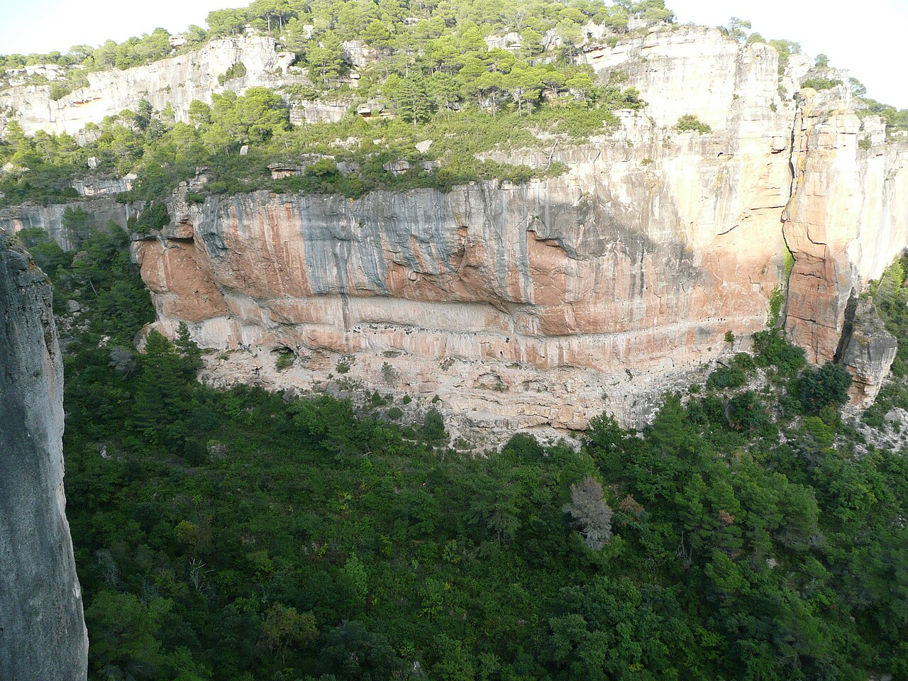

# シウラナ

スペイン・カタルーニャ州タラゴナ県、崖の上の小さな村の周囲に、30ほどの岩場が広がっている。ポケットとカチが彫り込まれたような石灰岩で、ルートは1000本以上ある。45度に被った短い課題から35mのスラブまで幅が広い。

1980年代からトニ・アルボネスらが開拓を進め、ヨーロッパのスポートクライミングの中心地のひとつになった。エル・パティ（El Pati）セクターの「La Rambla」（9a+）は、アレクサンダー・フーバーがボルトを打ち、2003年にラモン・フリアン・プッチブランケが完登している。

なお、アダム・オンドラとクリス・シャーマが登った「La Dura Dura」（9b+）はシウラナではなく、同じカタルーニャのオリアナ（Oliana）にある。

→ [アダム・オンドラ](/climbers/famous/adam-ondra/) / [クリス・シャーマ](/climbers/famous/chris-sharma/)

出典: [La Rambla（英語版ウィキペディア）](https://en.wikipedia.org/wiki/La_Rambla_(climb))、[Siurana（planetmountain）](https://www.planetmountain.com/en/crags/siurana.html)

シウラナのエル・パティ。La Rambla（9a+）があるセクター — Thomas Charbonneau（2009年） / <a href="https://commons.wikimedia.org/wiki/File:Siurana_secteur_El_Pati.jpg">Wikimedia Commons</a> / <a href="https://creativecommons.org/licenses/by-sa/4.0">CC BY-SA 4.0</a>

