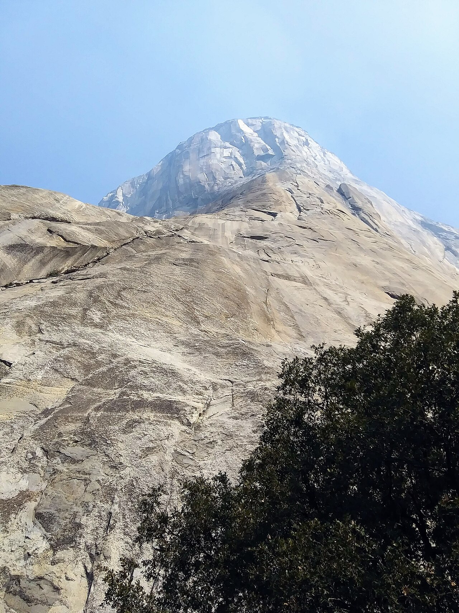
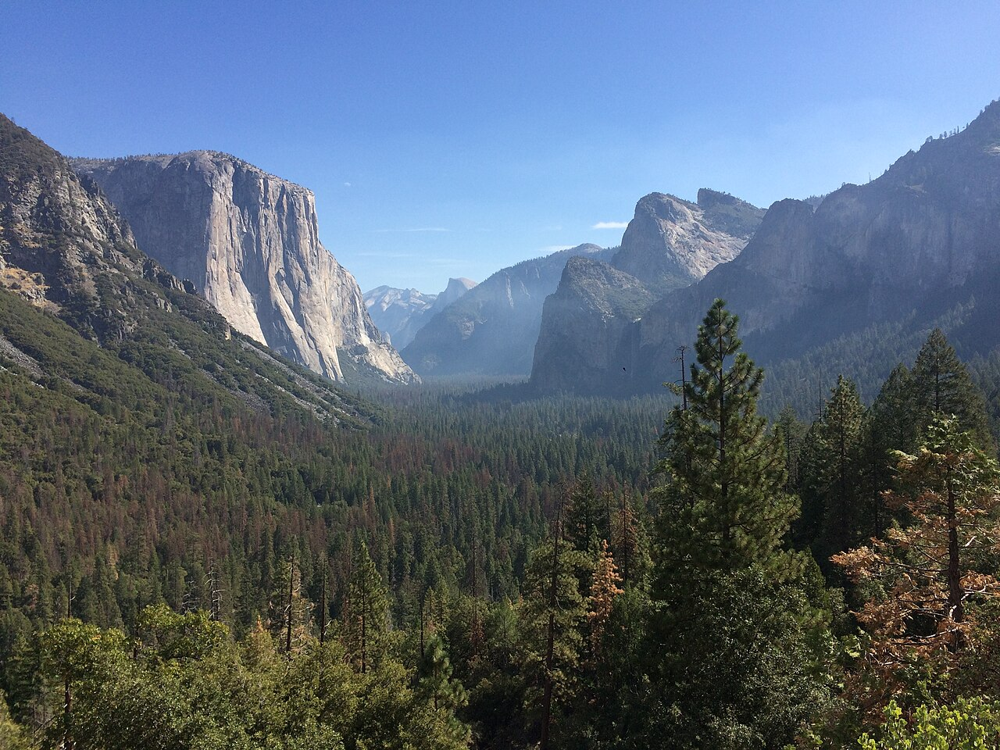

# ヨセミテ

アメリカ・カリフォルニア州の国立公園。谷を挟んで花崗岩の巨壁が立ち、中でもエル・キャピタンは高さ約900mの一枚岩になっている。

1958年、エル・キャピタンの「The Nose」が初登された。延べ45日をかけ、ピトン600本とボルト125本が打たれている。1960〜70年代には谷の中のキャンプ4に住み着いたクライマーたちが中心になり、道具で登るのではなく手と足で登るフリークライミングの考え方が固まっていった。

2017年6月3日、アレックス・オノルドがエル・キャピタンの「Freerider」（5.13a）をロープを使わずに登った。クラックとビッグウォールの本場であると同時に、キャンプ4周辺には古典的なボルダー課題もある。

→ [クライミングの歴史](/basics/history/) / [アレックス・オノルド](/climbers/famous/alex-honnold/)

出典: [El Capitan（英語版ウィキペディア）](https://en.wikipedia.org/wiki/El_Capitan)

エル・キャピタンを南東壁の基部から見上げる — Brian MacIntosh（2020年） / <a href="https://commons.wikimedia.org/wiki/File:El_Capitan,_Yosemite,_from_base_of_southeast_face.jpg">Wikimedia Commons</a> / <a href="https://creativecommons.org/licenses/by-sa/4.0">CC BY-SA 4.0</a>

谷の入口から見たエル・キャピタン — Melgna（2017年） / <a href="https://commons.wikimedia.org/wiki/File:El_Capitan_and_Valley_View.jpg">Wikimedia Commons</a> / <a href="https://creativecommons.org/licenses/by-sa/4.0">CC BY-SA 4.0</a>

