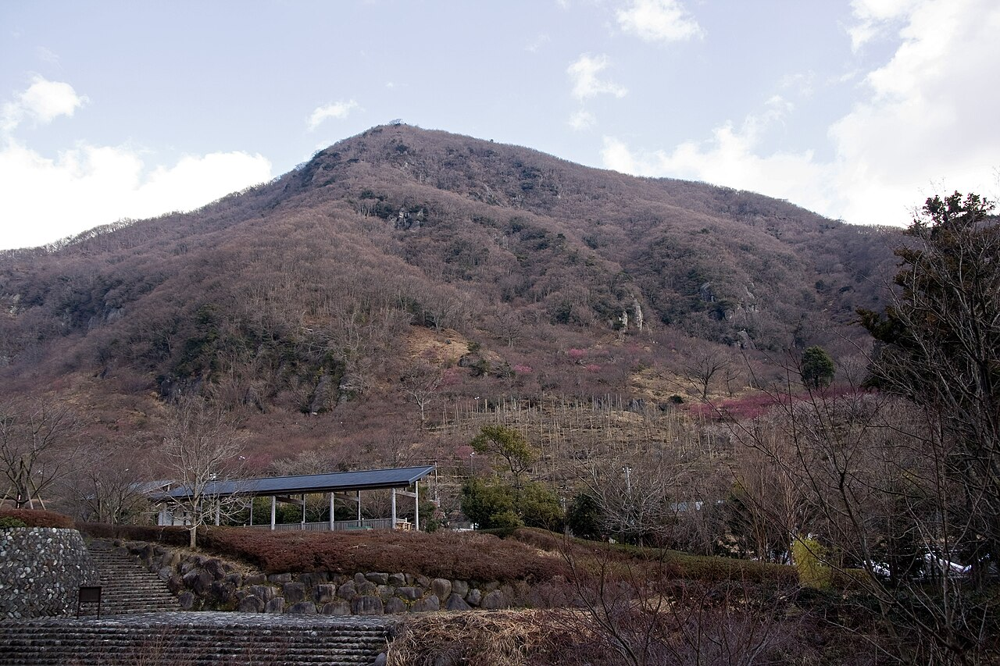

# 湯河原幕岩

神奈川県足柄下郡湯河原町鍛冶屋、幕山公園の中にある。岩質は凝灰岩。茅ヶ崎ロック、おとぎの森、正面壁などのセクターに分かれている。

ルートは370本あり、5.9以下が91本、5.10台が154本、5.11台が85本、5.12台が17本、5.13台が1本。入門から中級に厚みがあり、1本が短くて取り付きやすいので、人気ルートには順番待ちの列ができる。

日当たりがよく暖かいため、関東のクライマーにとって冬の定番になっている。シーズンは10月から5月。夏はおとぎの森や正面壁の右端など木陰のある場所に限られる。

湯河原駅からバスで診療所前まで行き、幕山公園まで徒歩25分。梅まつりの期間（1月下旬〜3月上旬）は入園料200円がかかる。立入禁止のエリアがあるので、行く前にJFAのサイトで現状を確認する。

幕山公園から見た幕山。斜面に露出した岩がクライミングエリアになっている — Σ64（2013年） / <a href="https://commons.wikimedia.org/wiki/File:Mt.Maku_02.jpg">Wikimedia Commons</a> / <a href="https://creativecommons.org/licenses/by/3.0">CC BY 3.0</a>

