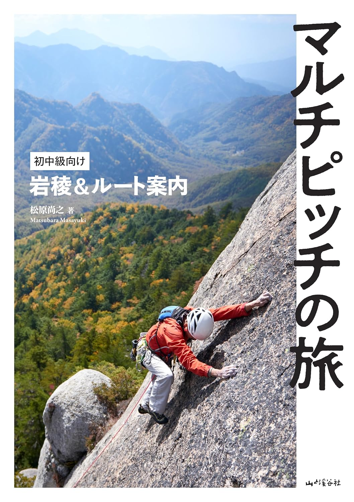
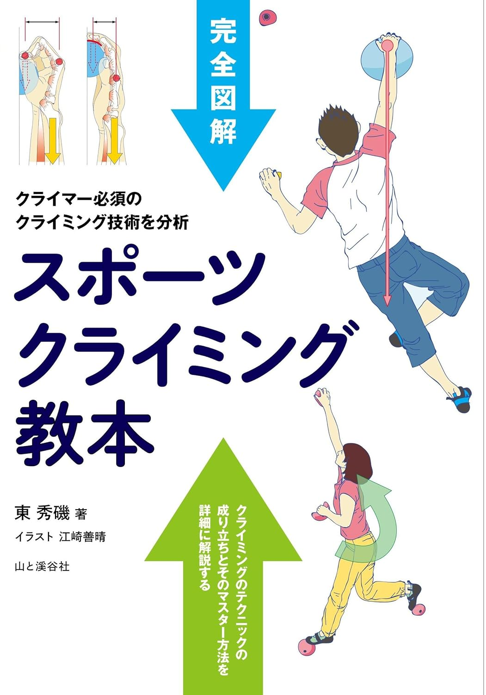
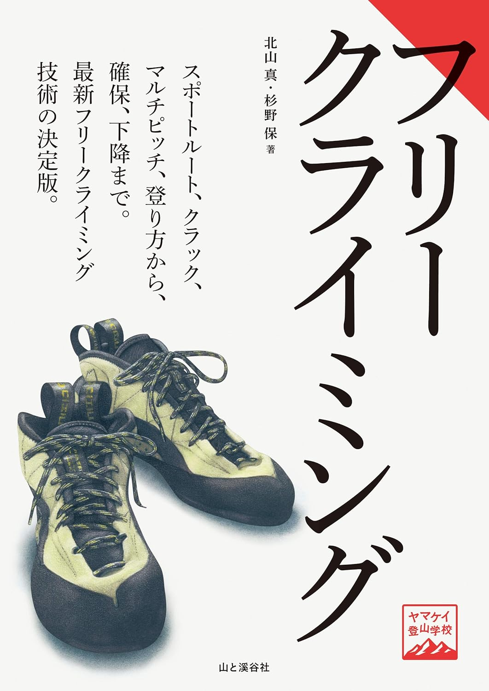
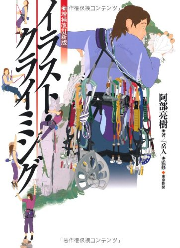
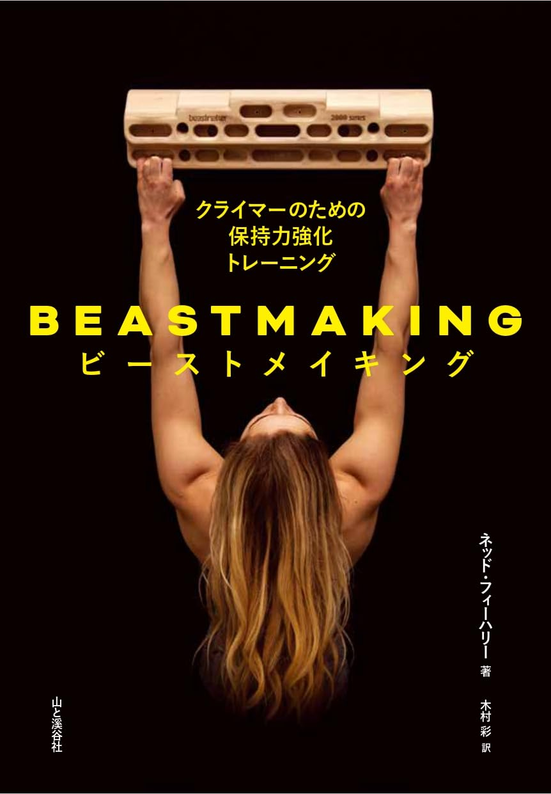
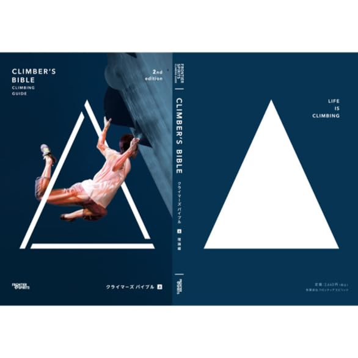
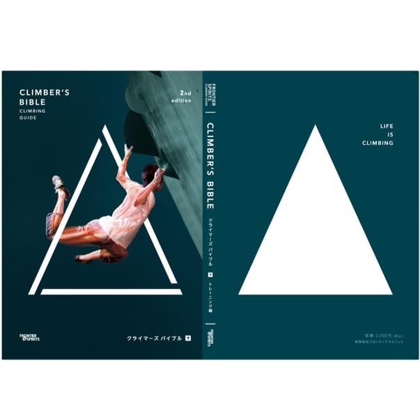
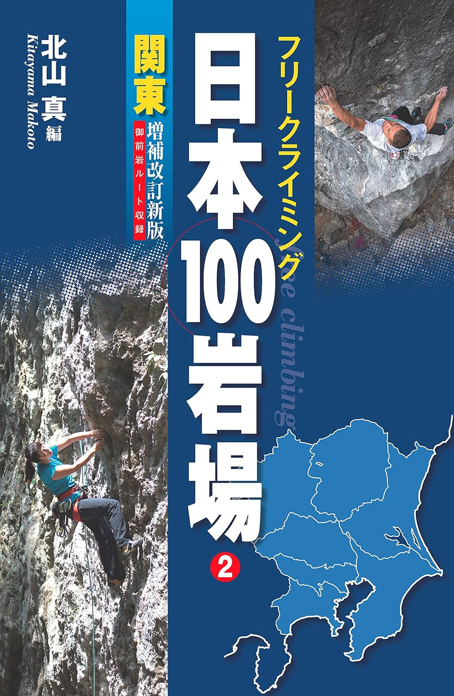

# 書籍

## ガイドブック

### マルチピッチの旅 初中級向け岩稜＆ルート案内

- 著者: 松原 尚之
- 出版: 山と溪谷社
- Amazon: <https://www.amazon.co.jp/dp/4635180573>
- 内容: 初中級者を対象に、マルチピッチクライミングに適した岩稜・ルートを紹介するガイドブック。アプローチや装備の選び方など実践的な情報も収録。

## 技術書

### 完全図解 スポーツクライミング教本

- 著者: 東 秀磯
- 出版: 山と溪谷社
- ページ数: 160ページ
- Amazon: <https://www.amazon.co.jp/dp/4635160203>
- 内容: 日本人初の国際ルートセッターにしてスポーツクライミング技術理論の第一人者である東 秀磯によるスポーツクライミング教本。クライミングテクニックの成り立ちと習得方法を理論的に解説。初・中級者向けの技術書をさらに詳しく発展させた内容で、カラーイラストと図版で解説している。

### ヤマケイ登山学校 フリークライミング

- 著者: 北山 真、杉野 保
- 出版: 山と溪谷社
- ページ数: 144ページ
- Amazon: <https://www.amazon.co.jp/dp/4635044203>
- 内容: ジムでのボルダリングからルートクライミング、クラッククライミング、マルチピッチまで、フリークライミングのすべてのジャンルを1冊にまとめた入門〜中級向け決定版。確保技術や安全に登るための知識も網羅している。

### 増補改訂新版 イラスト・クライミング

- 著者: 阿部 亮樹（監修: 岳人編集部）
- 出版: 東京新聞出版局
- ページ数: 238ページ
- Amazon: <https://www.amazon.co.jp/dp/4808309637>
- 内容: ロープの結び方から確保・懸垂下降・マルチピッチリードまで、クライミングの基本システムをカラーイラストで体系的に解説した入門〜中級向けの定番書。

## トレーニング書

### BEASTMAKING ビーストメイキング クライマーのための保持力強化トレーニング

- 著者: ネッド・フィーハリー（翻訳: 木村 彩）
- 出版: 山と溪谷社
- Amazon: <https://www.amazon.co.jp/dp/4635160289>
- 内容: フィンガーボード「Beastmaker」の創業者が書いた保持力強化の指南書。フィンガーボードトレーニングを中心に、ボードトレーニング・体幹・柔軟性の強化まで体系的に解説。楢崎智亜、アダム・オンドラ、アレックス・オノルドらのコメントも収録。

### クライマーズバイブル 2nd 上巻 理論編

- 著者: 内藤直也
- 出版: フロンティアスピリッツ（PUMP）
- Amazon: <https://www.amazon.co.jp/dp/B0CYWR2BJS>
- 内容: PUMPの25年にわたるノウハウを集約したクライミング上達バイブル。上巻はフォームとムーブの理論を深く掘り下げており、なぜそのムーブが有効かを理論的に理解できるよう構成されている。

### クライマーズバイブル 2nd 下巻 トレーニング編

- 著者: 内藤直也
- 出版: フロンティアスピリッツ（PUMP）
- Amazon: <https://www.amazon.co.jp/dp/B0CYWNZYVF>
- 内容: クライマーズバイブル下巻はトレーニング実践編。ボールなどの器具を用いた8種類のトレーニングを中心に、合理的な強化方法を解説する。

## トポ

日本全国の外岩エリアを5巻で網羅するシリーズ。著者: 北山 真 / 出版: 山と溪谷社。各巻ともルートのトポ図・グレード・アクセス・駐車情報を収録。一部エリアのトポはCLIMBING-netでも無料公開されている。

### フリークライミング日本100岩場 1 北海道・東北 増補改訂版

- Amazon: <https://www.amazon.co.jp/dp/4635180816>

### フリークライミング日本100岩場 2 関東 増補改訂新版

- Amazon: <https://www.amazon.co.jp/dp/4635180883>
- 備考: 御前岩ルート収録

### フリークライミング日本100岩場 3 伊豆・甲信 増補改訂新版

- Amazon: <https://www.amazon.co.jp/dp/4635180867>
- 備考: 瑞牆山ボルダー収録

### フリークライミング日本100岩場 4 東海・関西 増補改訂新版

- Amazon: <https://www.amazon.co.jp/dp/4635180891>
- 備考: ナサ崎・武庫川収録

### フリークライミング日本100岩場 5 中国・四国・九州 増補改訂版

- Amazon: <https://www.amazon.co.jp/dp/4635180859>
