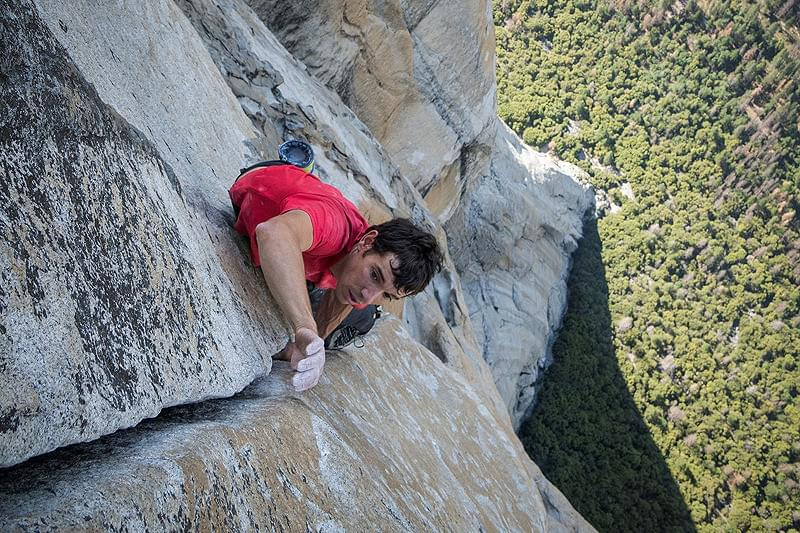
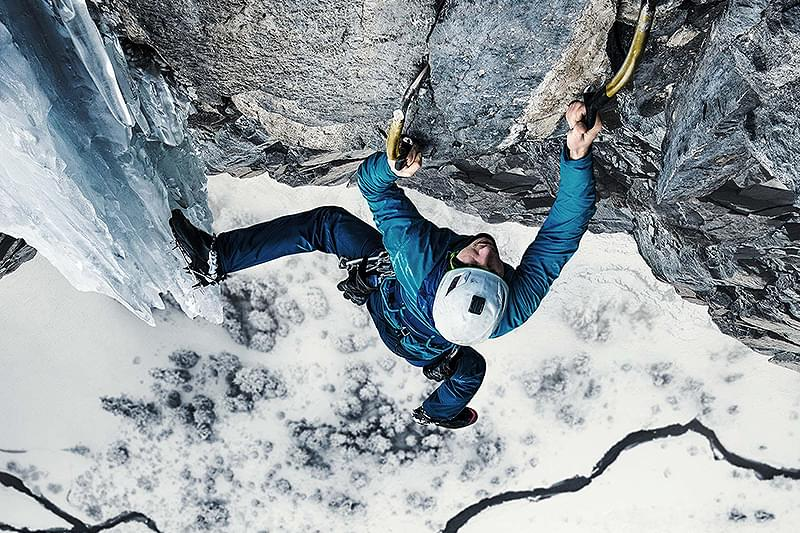
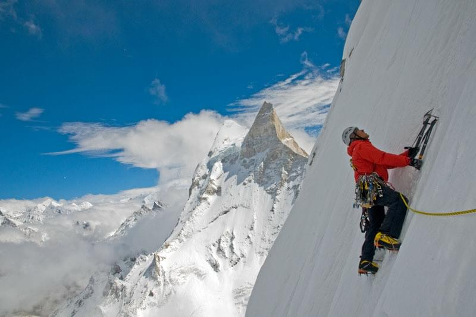
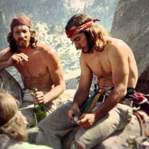
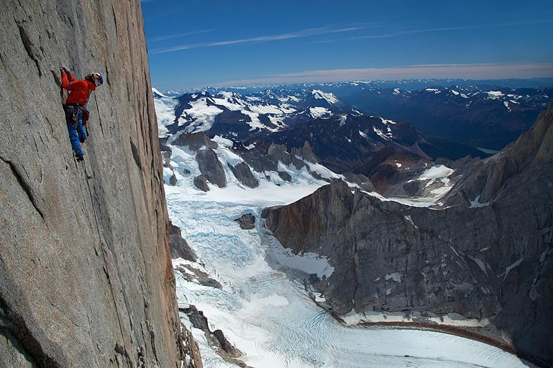
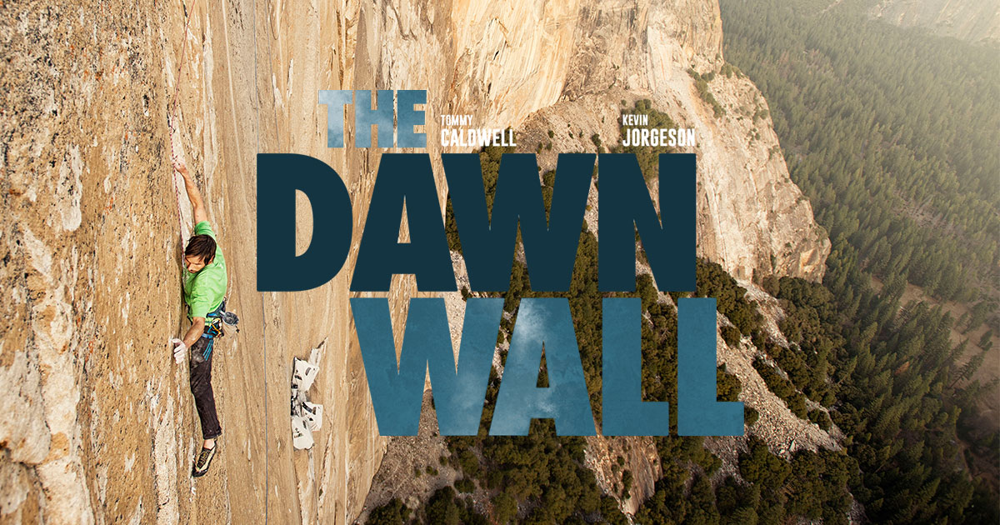
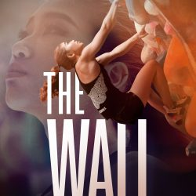
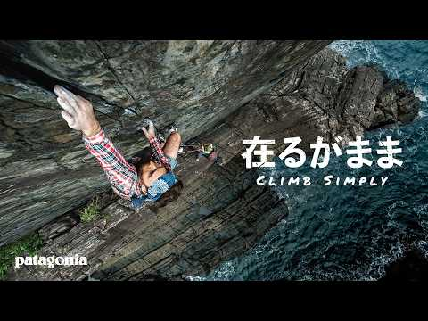
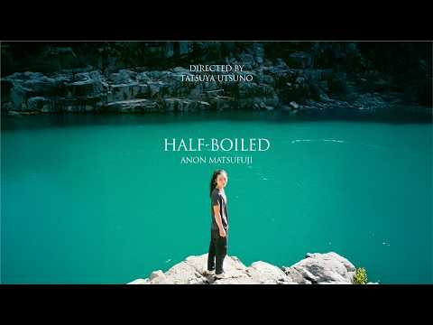

# 映画・ドラマ・アニメ・漫画

## ドキュメンタリー映画

### Free Solo（フリーソロ）

- 製作年: 2018年
- 監督: エリザベス・チャイ・ヴァサルヘリィ、ジミー・チン
- 配給: National Geographic
- 紹介ページ: <https://eiga.com/movie/91070/>
- 内容: アレックス・オノルドがヨセミテの「エル・キャピタン」（約900m）をロープなしで単独初登攀に挑む記録。準備から登攀当日まで密着取材した長編ドキュメンタリー。アカデミー賞長編ドキュメンタリー賞受賞。クライミングドキュメンタリーの中でもっとも広く知られた作品のひとつ。

### The Alpinist（アルピニスト）

- 製作年: 2021年
- 監督: ピーター・モーティマー、ニック・ローゼン
- 配給: Red Bull Media House
- 紹介ページ: <https://eiga.com/movie/97055/>
- 内容: カナダ人クライマー、マルク＝アンドレ・ルクレルクの孤独な登攀を追ったドキュメンタリー。世界最難関クラスのアルパインルートをほぼ単独・無酸素で完登しながら、メディアを拒み続けた謎多き人物像に迫る。撮影中にルクレルクが消息不明となる事態も描かれている。

### Meru（メルー）

- 製作年: 2015年
- 監督: ジミー・チン、エリザベス・チャイ・ヴァサルヘリィ
- 紹介ページ: <https://eiga.com/movie/85538/>
- 内容: コンラッド・アンカー、ジミー・チン、レナン・オズタークの3人が、ヒマラヤのメルー峰「シャークフィン」ルートへ2度挑んだ記録。初挑戦での敗退、各メンバーが経験した事故・病気・喪失を経て、再挑戦で初登頂を果たすまでを描く。

### Valley Uprising（バレー・アップライジング）

- 製作年: 2014年
- 監督: ピーター・モーティマー、ニック・ローゼン
- 紹介ページ: <https://www.climbing-net.com/news/valleyuprising_180824/>
- 内容: 1950〜80年代のヨセミテを中心に、クライミングのカウンターカルチャーを描く歴史ドキュメンタリー。ロイヤル・ロビンズ、イヴォン・シュイナード、ジョン・バカーといった先駆者たちが、国立公園のルールと衝突しながら現代クライミングの礎を作る様子を当時の映像と証言でたどる。

### クライマー パタゴニアの彼方へ

- 製作年: 2013年（日本公開: 2014年）
- 監督: トーマス・ディルンホーファー
- 紹介ページ: <https://eiga.com/movie/79732/>
- 内容: オーストリア出身のフリークライミング世界チャンピオン、デビッド・ラマが、南米パタゴニアの岩峰「セロ・トーレ」南東稜へのフリークライミング初登に3年間挑んだ記録。垂直に切り立った花崗岩の壁に、ロープ以外の人工的な援助なしで挑む姿を追う。若く純粋にクライミングと向き合うラマの姿が印象的な作品。

### The Dawn Wall（ドーンウォール）

- 製作年: 2017年
- 監督: ジョシュ・ロウエル、ピーター・モーティマー
- 紹介ページ: <https://www.staticbloom.co.jp/dawnwall/>
- 内容: トミー・コールドウェルとケビン・ジョーゲソンが2015年にエル・キャピタン「ドーンウォール」ルートのフリークライミング初登に挑んだ記録。コールドウェルの半生（キルギスでの人質事件、離婚）と19日間に及ぶ登攀を交互に描く。

### THE WALL – CLIMB FOR GOLD

- 製作年: 2021年（配信開始: 2022年1月）
- 配信: Apple TV / Google Play / Amazon Prime Video
- 紹介ページ: <https://www.climbing-net.com/news/thewall-climbforgold_20211224/>
- 内容: 東京五輪延期によって狂ったシーズンの中、トップクライマーとしての自分と向き合う選手たちを2年間密着したドキュメンタリー。野中生萌（日本）、ヤーニャ・ガーンブレット（スロベニア）、ショウナ・コクシー（イギリス）、ブルック・ラブトゥ（アメリカ）が出演。競技クライミングの舞台裏と選手の素顔を描く。

## 短編フィルム

### 在るがまま | Climb Simply

- 制作: パタゴニア / 撮影: 鈴木岳美（TAKEMOVE）
- 紹介ページ: <https://www.climbing-net.com/news/patagonia-climb-simply/>
- 内容: ショーン・ヴィラヌエバ・オドリスコール、横山勝丘（ジャンボ）、王鞍彗介、倉上慶大が屋久島を訪れた際の記録フィルム。「変えられない環境を受け入れ、その中で楽しむことを自分で選ぶ」というクライマーのマインドセットを、屋久島の自然の中での登攀を通じて描く。パタゴニア制作。

### HALF-BOILED（半熟）

- 紹介ページ: <https://www.climbing-net.com/news/half-boiled-anon-matsufuji/>
- 内容: 松藤藍夢が高難度ボルダー「現世」（五段/V14）の完登に挑む過程を追ったフィルム。完登前に製作を始めたため「半熟」と名付けられた。葛藤しながら課題と向き合い成長していく姿を記録する。

## 漫画

### 岳 〜みんなの山〜

- 著者: 石塚 真一
- 出版: 小学館（ビッグコミックオリジナル）
- 連載: 2003〜2012年
- 内容: 北アルプスを舞台に、山岳救助ボランティアの島崎三歩と長野県警山岳救助隊の活動を描く山岳漫画。死と隣り合わせの山の現実を描きながら、山を愛する人々への敬意が貫かれた作品。映画化（2011年）もされた。スポーツクライミングではなく登山・山岳救助が中心だが、クライミングに関心を持つ人々に広く読まれている。

### 孤高の人

- 著者: 坂本 眞一（原作: 鍋田 吉郎、原案: 新田 次郎）
- 出版: 集英社（ヤングジャンプ）
- 連載: 2007〜2011年
- 内容: 実在の登山家・加藤文太郎をモデルにした孤高のクライマー・孤独な単独行をテーマにした山岳漫画。単独・無酸素・最小装備にこだわる主人公の姿を通じて、山と人間の関係を問う。リードクライミングや岩稜帯の描写も多い。
