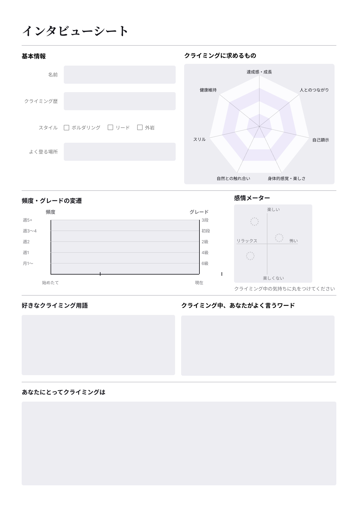

# インタビューシート

インタビューの場で相手に書いてもらう A4 1枚のシート。話しながら手を動かしてもらうことで、口頭では出てきにくい程度や変化を残す。

書いてもらう項目:

- **基本情報** — 名前、クライミング歴、登るスタイル（ボルダリング／リード／外岩）、よく登る場所
- **クライミングに求めるもの** — 達成感・成長／人とのつながり／自己顕示／身体的感覚・楽しさ／自然との触れ合い／スリル／健康維持の7項目に、どのくらい当てはまるかを塗ってもらう
- **頻度・グレードの変遷** — 始めたてから現在までを1本の線で描いてもらう。縦軸は左が登る頻度、右がグレード
- **感情メーター** — 楽しい／楽しくない、リラックス／怖いの2軸に、クライミング中の気持ちを丸で置いてもらう
- **好きなクライミング用語** と **クライミング中によく言うワード**
- **あなたにとってクライミングは** — 最後に自由記述
